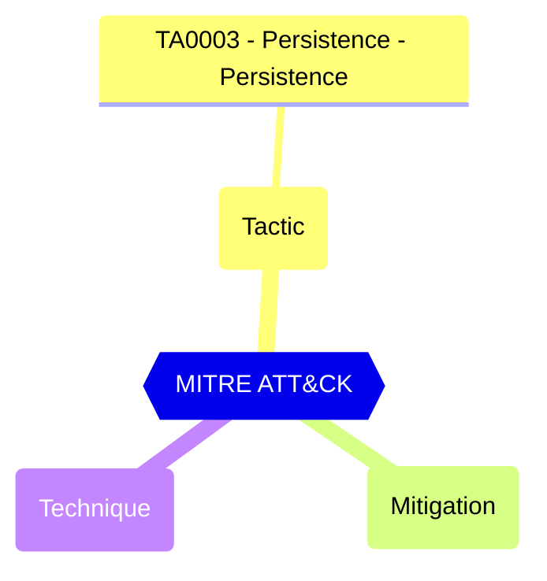

# Default Authorization Settings - Guest invite restrictions

Manages controls who can invite guests to your directory to collaborate on resources secured by your Azure AD, such as SharePoint sites or Azure resources.

| | |
|-|-|
| **Name** | allowInvitesFrom |
| **Control** | Default Authorization Settings |
| **Description** | Manages authorization settings in Azure AD |
| **Severity** | Medium |

## How to fix

### Details of configuration item
| | |
|-|-|
| **Recommendation** | CISA SCuBA 2.18: Only users with the Guest Inviter role SHOULD be able to invite guest users |
| **Configuration** | policies/authorizationPolicy |
| **Setting** | `allowInvitesFrom` |
| **Recommended Value** | 'adminsAndGuestInviters','none' |
| **Default Value** | everyone |
| **Graph API Docs** | [authorizationPolicy resource type - Microsoft Graph v1.0 - Microsoft Learn](https://learn.microsoft.com/en-us/graph/api/resources/authorizationpolicy) |
| **Graph Explorer** | [Open in Graph Explorer](https://developer.microsoft.com/en-us/graph/graph-explorer?request=policies/authorizationPolicy&method=GET&version=beta&GraphUrl=https://graph.microsoft.com) |

## MITRE ATT&CK

|Tactic|Technique|Mitigation|
|---|---|---|
|[TA0003 - Persistence - Persistence](https://attack.mitre.org/tactics/TA0003)|||

