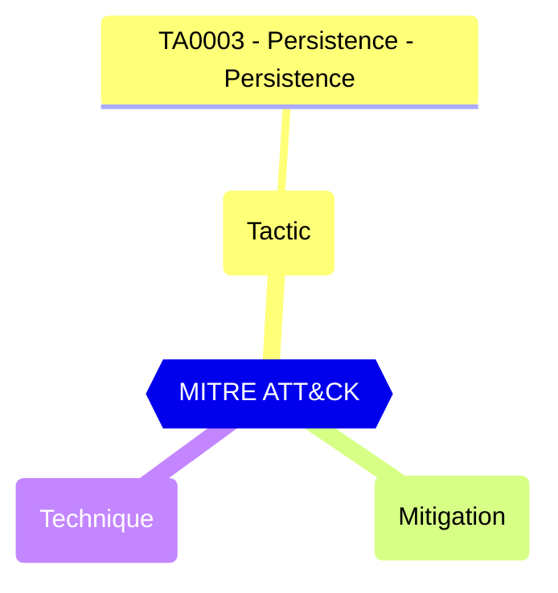

<!-- This file is generated by website/scripts/generate-test-docs.mjs. Do not edit manually. -->

# EIDSCA.AP04 - Default Authorization Settings - Guest invite restrictions.

<div className="test-byline"><div className="test-byline-avatars"><a className="test-byline-avatar test-byline-avatar--author" href="/contributors/cloud-architekt" title="Thomas Naunheim · Original author"></a></div><div className="test-byline-meta"><span className="test-byline-text">Contributed by <a href="/contributors/cloud-architekt">Thomas Naunheim</a></span><a className="test-byline-link" href="/contributors">All contributors →</a></div></div>

## Overview

Manages controls who can invite guests to your directory to collaborate on resources secured by your Entra ID (Azure AD), such as SharePoint sites or Azure resources.

CISA SCuBA 2.18: Only users with the Guest Inviter role SHOULD be able to invite guest users

#### Test script
```
https://graph.microsoft.com/beta/policies/authorizationPolicy
.allowInvitesFrom -in @('adminsAndGuestInviters','none')
```


#### Related links

- [Open in Graph Explorer](https://developer.microsoft.com/graph/graph-explorer?request=policies/authorizationPolicy&method=GET&version=beta&GraphUrl=https://graph.microsoft.com)
- [authorizationPolicy resource type - Microsoft Graph v1.0 | Microsoft Learn](https://learn.microsoft.com/graph/api/resources/authorizationpolicy)
- [View in Microsoft Entra admin center](https://entra.microsoft.com/#view/Microsoft_AAD_IAM/AllowlistPolicyBlade)

## MITRE ATT&CK


```mermaid
mindmap
  root{{MITRE ATT&CK}}
    (Tactic)
      TA0003 - Persistence - Persistence
    (Mitigation)

    (Technique)

```
|Tactic|Technique|Mitigation|
|---|---|---|
|[TA0003 - Persistence - Persistence](https://attack.mitre.org/tactics/TA0003)|||

## Test Metadata

| Field | Value |
| --- | --- |
| Test ID | EIDSCA.AP04 |
| Severity | Medium |
| Suite | Entra ID SCA |
| Category | General |
| PowerShell test | [Test-MtCheckEidscaAP04](https://github.com/maester365/maester/blob/main/tests/EIDSCA/Test.EIDSCA.AP04.ps1) |
| Services | Graph |
| Tags | EIDSCA, EIDSCA.AP04 |

## Source

- Test: [`tests/EIDSCA/Test.EIDSCA.AP04.ps1`](https://github.com/maester365/maester/blob/main/tests/EIDSCA/Test.EIDSCA.AP04.ps1)
- Documentation: [`tests/EIDSCA/Test.EIDSCA.AP04.md`](https://github.com/maester365/maester/blob/main/tests/EIDSCA/Test.EIDSCA.AP04.md)
