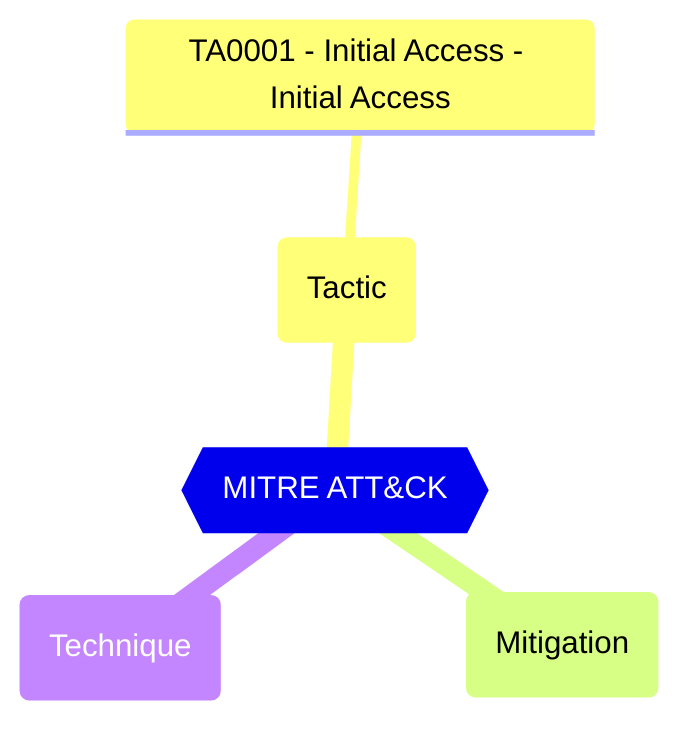

<!-- This file is generated by website/scripts/generate-test-docs.mjs. Do not edit manually. -->

# EIDSCA.AP05 - Default Authorization Settings - Sign-up for email based subscription.

<div className="test-byline"><div className="test-byline-avatars"><a className="test-byline-avatar test-byline-avatar--author" href="/contributors/cloud-architekt" title="Thomas Naunheim · Original author"></a><a className="test-byline-avatar" href="/contributors/merill" title="Merill Fernando · Co-contributor"></a><a className="test-byline-avatar" href="/contributors/f-bader" title="Fabian Bader · Co-contributor"></a><a className="test-byline-avatar" href="/contributors/samerde" title="Sam Erde · Co-contributor"></a></div><div className="test-byline-meta"><span className="test-byline-text">Contributed by <a href="/contributors/cloud-architekt">Thomas Naunheim</a> with 3 co-contributors</span><a className="test-byline-link" href="/contributors">All contributors →</a></div></div>

## Overview

Indicates whether users can sign up for email based subscriptions.


#### Test script
```
https://graph.microsoft.com/beta/policies/authorizationPolicy
.allowedToSignUpEmailBasedSubscriptions -eq 'false'
```

#### Related links

- [Open in Graph Explorer](https://developer.microsoft.com/en-us/graph/graph-explorer?request=policies/authorizationPolicy&method=GET&version=beta&GraphUrl=https://graph.microsoft.com)
- [authorizationPolicy resource type - Microsoft Graph v1.0 | Microsoft Learn](https://learn.microsoft.com/en-us/graph/api/resources/authorizationpolicy)


## MITRE ATT&CK


```mermaid
mindmap
  root{{MITRE ATT&CK}}
    (Tactic)
      TA0001 - Initial Access - Initial Access
    (Mitigation)

    (Technique)

```
|Tactic|Technique|Mitigation|
|---|---|---|
|[TA0001 - Initial Access - Initial Access](https://attack.mitre.org/tactics/TA0001)|||

## Test Metadata

| Field | Value |
| --- | --- |
| Test ID | EIDSCA.AP05 |
| Severity | Medium |
| Suite | Entra ID SCA |
| Category | General |
| PowerShell test | [Test-MtEidscaAP05](/docs/commands/Test-MtEidscaAP05) |
| Tags | EIDSCA, EIDSCA.AP05 |

## Source

- Pester test: `tests/EIDSCA/Test-EIDSCA.Generated.Tests.ps1`
- PowerShell source: `powershell/internal/eidsca/Test-MtEidscaAP05.ps1`
