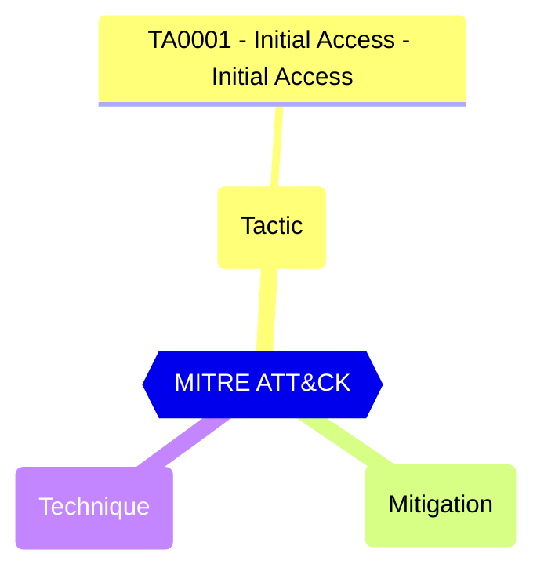

<!-- This file is generated by website/scripts/generate-test-docs.mjs. Do not edit manually. -->

# EIDSCA.AP06 - Default Authorization Settings - User can join the tenant by email validation.

## Overview

Controls whether users can join the tenant by email validation. To join, the user must have an email address in a domain which matches one of the verified domains in the tenant.

[Self-service sign up for email-verified users - Microsoft Entra ID - Microsoft Learn](https://learn.microsoft.com/en-us/azure/active-directory/enterprise-users/directory-self-service-signup)

#### Test script
```
https://graph.microsoft.com/beta/policies/authorizationPolicy
.allowEmailVerifiedUsersToJoinOrganization -eq 'false'
```

#### Related links

- [Open in Graph Explorer](https://developer.microsoft.com/en-us/graph/graph-explorer?request=policies/authorizationPolicy&method=GET&version=beta&GraphUrl=https://graph.microsoft.com)
- [authorizationPolicy resource type - Microsoft Graph v1.0 | Microsoft Learn](https://learn.microsoft.com/en-us/graph/api/resources/authorizationpolicy)


## MITRE ATT&CK


```mermaid
mindmap
  root{{MITRE ATT&CK}}
    (Tactic)
      TA0001 - Initial Access - Initial Access
    (Mitigation)

    (Technique)

```
|Tactic|Technique|Mitigation|
|---|---|---|
|[TA0001 - Initial Access - Initial Access](https://attack.mitre.org/tactics/TA0001)|||

## Test Metadata

| Field | Value |
| --- | --- |
| Test ID | EIDSCA.AP06 |
| Severity | Medium |
| Suite | Entra ID SCA |
| Category | General |
| PowerShell test | [Test-MtEidscaAP06](/docs/commands/Test-MtEidscaAP06) |
| Tags | EIDSCA, EIDSCA.AP06 |

## Source

- Pester test: `tests/EIDSCA/Test-EIDSCA.Generated.Tests.ps1`
- PowerShell source: `powershell/internal/eidsca/Test-MtEidscaAP06.ps1`
