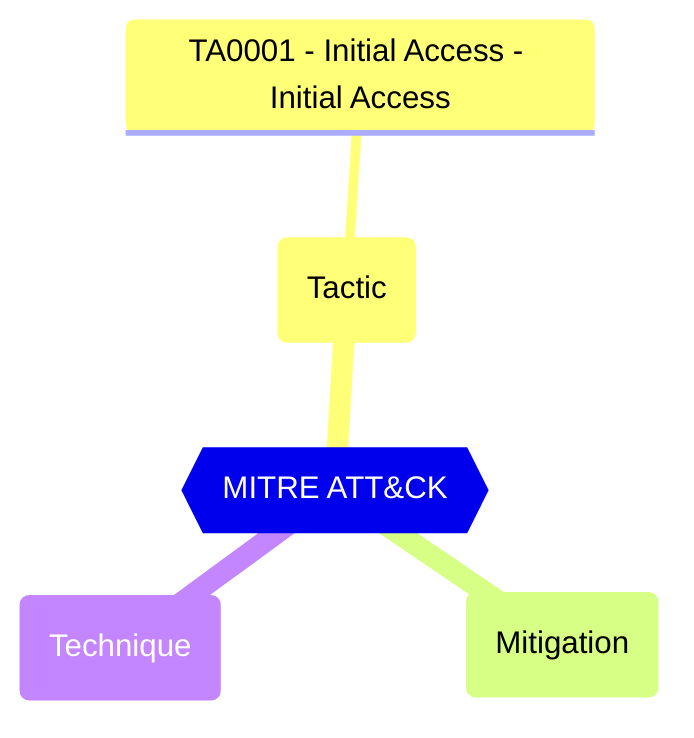

<!-- This file is generated by website/scripts/generate-test-docs.mjs. Do not edit manually. -->

# EIDSCA.AP06 - Default Authorization Settings - User can join the tenant by email validation.

<div className="test-byline"><div className="test-byline-avatars"><a className="test-byline-avatar test-byline-avatar--author" href="/contributors/cloud-architekt" title="Thomas Naunheim · Original author"></a></div><div className="test-byline-meta"><span className="test-byline-text">Contributed by <a href="/contributors/cloud-architekt">Thomas Naunheim</a></span><a className="test-byline-link" href="/contributors">All contributors →</a></div></div>

## Overview

Controls whether users can join the tenant by email validation. To join, the user must have an email address in a domain which matches one of the verified domains in the tenant.

[Self-service sign up for email-verified users - Microsoft Entra ID - Microsoft Learn](https://learn.microsoft.com/azure/active-directory/enterprise-users/directory-self-service-signup)

#### Test script
```
https://graph.microsoft.com/beta/policies/authorizationPolicy
.allowEmailVerifiedUsersToJoinOrganization -eq 'false'
```


#### Related links

- [Open in Graph Explorer](https://developer.microsoft.com/graph/graph-explorer?request=policies/authorizationPolicy&method=GET&version=beta&GraphUrl=https://graph.microsoft.com)
- [authorizationPolicy resource type - Microsoft Graph v1.0 | Microsoft Learn](https://learn.microsoft.com/graph/api/resources/authorizationpolicy)


## MITRE ATT&CK


```mermaid
mindmap
  root{{MITRE ATT&CK}}
    (Tactic)
      TA0001 - Initial Access - Initial Access
    (Mitigation)

    (Technique)

```
|Tactic|Technique|Mitigation|
|---|---|---|
|[TA0001 - Initial Access - Initial Access](https://attack.mitre.org/tactics/TA0001)|||

## Test Metadata

| Field | Value |
| --- | --- |
| Test ID | EIDSCA.AP06 |
| Severity | Medium |
| Suite | Entra ID SCA |
| Category | General |
| PowerShell test | [Test-MtCheckEidscaAP06](https://github.com/maester365/maester/blob/main/tests/EIDSCA/Test.EIDSCA.AP06.ps1) |
| Services | Graph |
| Tags | EIDSCA, EIDSCA.AP06 |

## Source

- Test: [`tests/EIDSCA/Test.EIDSCA.AP06.ps1`](https://github.com/maester365/maester/blob/main/tests/EIDSCA/Test.EIDSCA.AP06.ps1)
- Documentation: [`tests/EIDSCA/Test.EIDSCA.AP06.md`](https://github.com/maester365/maester/blob/main/tests/EIDSCA/Test.EIDSCA.AP06.md)
