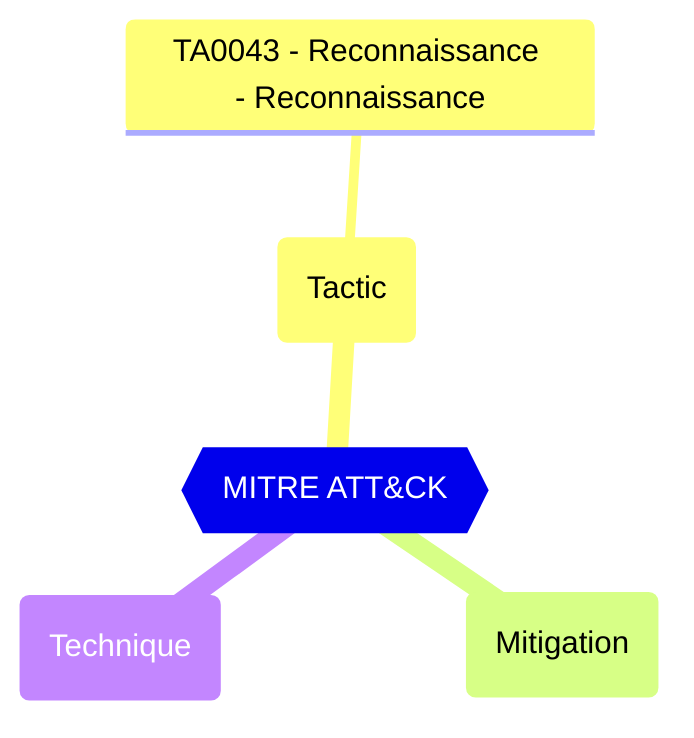

<!-- This file is generated by website/scripts/generate-test-docs.mjs. Do not edit manually. -->

# EIDSCA.AP07 - Default Authorization Settings - Guest user access.

<div className="test-byline"><div className="test-byline-avatars"><a className="test-byline-avatar test-byline-avatar--author" href="/contributors/cloud-architekt" title="Thomas Naunheim · Original author"></a><a className="test-byline-avatar" href="/contributors/merill" title="Merill Fernando · Co-contributor"></a><a className="test-byline-avatar" href="/contributors/f-bader" title="Fabian Bader · Co-contributor"></a><a className="test-byline-avatar" href="/contributors/samerde" title="Sam Erde · Co-contributor"></a></div><div className="test-byline-meta"><span className="test-byline-text">Contributed by <a href="/contributors/cloud-architekt">Thomas Naunheim</a> with 3 co-contributors</span><a className="test-byline-link" href="/contributors">All contributors →</a></div></div>

## Overview

Represents role templateId for the role that should be granted to guest user.

CISA SCuBA 2.18: Guest users SHOULD have limited access to Entra ID (Azure AD) directory objects.

#### Test script
```
https://graph.microsoft.com/beta/policies/authorizationPolicy
.guestUserRoleId -eq '2af84b1e-32c8-42b7-82bc-daa82404023b'
```

#### Related links

- [Open in Graph Explorer](https://developer.microsoft.com/en-us/graph/graph-explorer?request=policies/authorizationPolicy&method=GET&version=beta&GraphUrl=https://graph.microsoft.com)
- [authorizationPolicy resource type - Microsoft Graph v1.0 | Microsoft Learn](https://learn.microsoft.com/en-us/graph/api/resources/authorizationpolicy)
- [View in Microsoft Entra admin center](https://entra.microsoft.com/#view/Microsoft_AAD_IAM/AllowlistPolicyBlade)

## MITRE ATT&CK


|Tactic|Technique|Mitigation|
|---|---|---|
|[TA0043 - Reconnaissance - Reconnaissance](https://attack.mitre.org/tactics/TA0043)|||

## Test Metadata

| Field | Value |
| --- | --- |
| Test ID | EIDSCA.AP07 |
| Severity | High |
| Suite | Entra ID SCA |
| Category | General |
| PowerShell test | [Test-MtEidscaAP07](/docs/commands/Test-MtEidscaAP07) |
| Tags | EIDSCA, EIDSCA.AP07 |

## Source

- Pester test: `tests/EIDSCA/Test-EIDSCA.Generated.Tests.ps1`
- PowerShell source: `powershell/internal/eidsca/Test-MtEidscaAP07.ps1`
