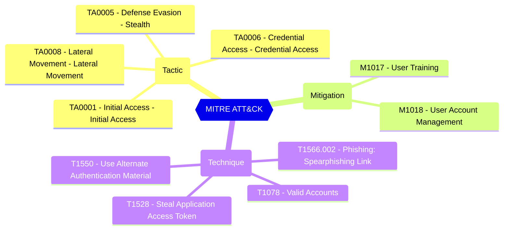

<!-- This file is generated by website/scripts/generate-test-docs.mjs. Do not edit manually. -->

# EIDSCA.AP08 - Default Authorization Settings - User consent policy assigned for applications.

## Overview

Defines if user consent to apps is allowed, and if it is, which app consent policy (permissionGrantPolicy) governs the permissions.

Microsoft recommends to allow to user consent for apps from verified publisher for selected permissions. CISA SCuBA 2.7 defines that all Non-Admin Users SHALL Be Prevented From Providing Consent To Third-Party Applications.

#### Test script
```
https://graph.microsoft.com/beta/policies/authorizationPolicy
.permissionGrantPolicyIdsAssignedToDefaultUserRole -clike 'ManagePermissionGrantsForSelf*' -eq 'ManagePermissionGrantsForSelf.microsoft-user-default-low'
```

#### Related links

- [Open in Graph Explorer](https://developer.microsoft.com/en-us/graph/graph-explorer?request=policies/authorizationPolicy&method=GET&version=beta&GraphUrl=https://graph.microsoft.com)
- [authorizationPolicy resource type - Microsoft Graph v1.0 | Microsoft Learn](https://learn.microsoft.com/en-us/graph/api/resources/authorizationpolicy)
- [View in Microsoft Entra admin center](https://entra.microsoft.com/#view/Microsoft_AAD_UsersAndTenants/UserManagementMenuBlade/~/UserSettings)

## MITRE ATT&CK


|Tactic|Technique|Mitigation|
|---|---|---|
|[TA0001 - Initial Access - Initial Access](https://attack.mitre.org/tactics/TA0001)<br/>[TA0005 - Defense Evasion - Stealth](https://attack.mitre.org/tactics/TA0005)<br/>[TA0006 - Credential Access - Credential Access](https://attack.mitre.org/tactics/TA0006)<br/>[TA0008 - Lateral Movement - Lateral Movement](https://attack.mitre.org/tactics/TA0008)|[T1566.002 - Phishing: Spearphishing Link](https://attack.mitre.org/techniques/T1566/002)<br/>[T1078 - Valid Accounts](https://attack.mitre.org/techniques/T1078)<br/>[T1550 - Use Alternate Authentication Material](https://attack.mitre.org/techniques/T1550)<br/>[T1528 - Steal Application Access Token](https://attack.mitre.org/techniques/T1528)|[M1017 - User Training](https://attack.mitre.org/mitigations/M1017)<br/>[M1018 - User Account Management](https://attack.mitre.org/mitigations/M1018)|

## Test Metadata

| Field | Value |
| --- | --- |
| Test ID | EIDSCA.AP08 |
| Severity | Medium |
| Suite | Entra ID SCA |
| Category | General |
| PowerShell test | [Test-MtEidscaAP08](/docs/commands/Test-MtEidscaAP08) |
| Tags | EIDSCA, EIDSCA.AP08 |

## Source

- Pester test: `tests/EIDSCA/Test-EIDSCA.Generated.Tests.ps1`
- PowerShell source: `powershell/internal/eidsca/Test-MtEidscaAP08.ps1`
