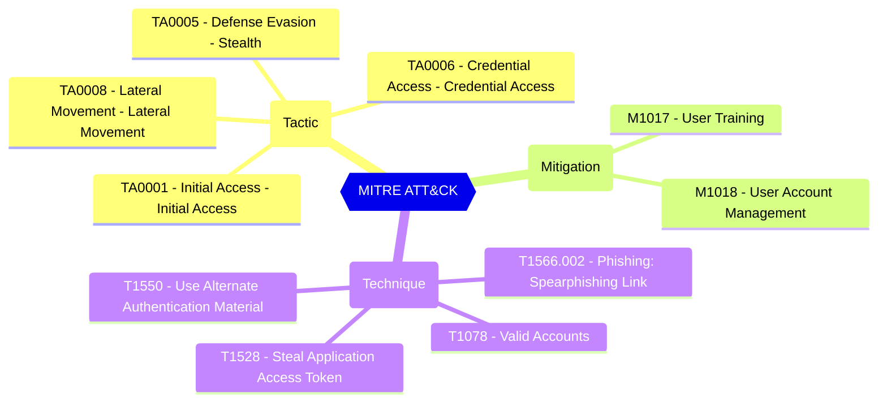

<!-- This file is generated by website/scripts/generate-test-docs.mjs. Do not edit manually. -->

# EIDSCA.AP09 - Default Authorization Settings - Allow user consent on risk-based apps.

## Overview

Indicates whether user consent for risky apps is allowed. For example, consent requests for newly registered multi-tenant apps that are not publisher verified and require non-basic permissions are considered risky.

[Configure risk-based step-up consent - Microsoft Entra ID - Microsoft Learn](https://learn.microsoft.com/en-us/azure/active-directory/manage-apps/configure-risk-based-step-up-consent)

#### Test script
```
https://graph.microsoft.com/beta/policies/authorizationPolicy
.allowUserConsentForRiskyApps -eq 'false'
```

#### Related links

- [Open in Graph Explorer](https://developer.microsoft.com/en-us/graph/graph-explorer?request=policies/authorizationPolicy&method=GET&version=beta&GraphUrl=https://graph.microsoft.com)
- [authorizationPolicy resource type - Microsoft Graph v1.0 | Microsoft Learn](https://learn.microsoft.com/en-us/graph/api/resources/authorizationpolicy)
- [View in Microsoft Entra admin center](https://entra.microsoft.com/#view/Microsoft_AAD_IAM/ConsentPoliciesMenuBlade/~/UserSettings)

## MITRE ATT&CK


|Tactic|Technique|Mitigation|
|---|---|---|
|[TA0001 - Initial Access - Initial Access](https://attack.mitre.org/tactics/TA0001)<br/>[TA0005 - Defense Evasion - Stealth](https://attack.mitre.org/tactics/TA0005)<br/>[TA0006 - Credential Access - Credential Access](https://attack.mitre.org/tactics/TA0006)<br/>[TA0008 - Lateral Movement - Lateral Movement](https://attack.mitre.org/tactics/TA0008)|[T1566.002 - Phishing: Spearphishing Link](https://attack.mitre.org/techniques/T1566/002)<br/>[T1078 - Valid Accounts](https://attack.mitre.org/techniques/T1078)<br/>[T1550 - Use Alternate Authentication Material](https://attack.mitre.org/techniques/T1550)<br/>[T1528 - Steal Application Access Token](https://attack.mitre.org/techniques/T1528)|[M1017 - User Training](https://attack.mitre.org/mitigations/M1017)<br/>[M1018 - User Account Management](https://attack.mitre.org/mitigations/M1018)|

## Test Metadata

| Field | Value |
| --- | --- |
| Test ID | EIDSCA.AP09 |
| Severity | Medium |
| Suite | Entra ID SCA |
| Category | General |
| PowerShell test | [Test-MtEidscaAP09](/docs/commands/Test-MtEidscaAP09) |
| Tags | EIDSCA, EIDSCA.AP09 |

## Source

- Pester test: `tests/EIDSCA/Test-EIDSCA.Generated.Tests.ps1`
- PowerShell source: `powershell/internal/eidsca/Test-MtEidscaAP09.ps1`
