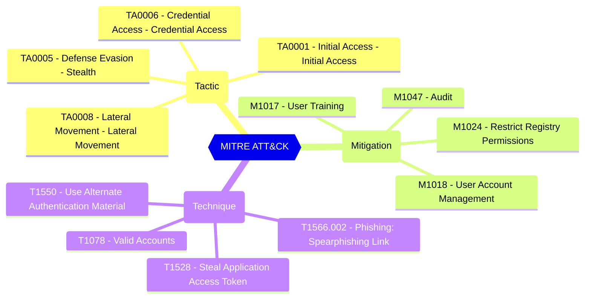

<!-- This file is generated by website/scripts/generate-test-docs.mjs. Do not edit manually. -->

# EIDSCA.AP10 - Default Authorization Settings - Default User Role Permissions - Allowed to create Apps.

<div className="test-byline"><div className="test-byline-avatars"><a className="test-byline-avatar test-byline-avatar--author" href="/contributors/cloud-architekt" title="Thomas Naunheim · Original author"></a></div><div className="test-byline-meta"><span className="test-byline-text">Contributed by <a href="/contributors/cloud-architekt">Thomas Naunheim</a></span><a className="test-byline-link" href="/contributors">All contributors →</a></div></div>

## Overview

Controls if non-admin users may register custom-developed applications for use within this directory.

CISA SCuBA 2.6: Only Administrators SHALL Be Allowed To Register Third-Party Applications

#### Test script
```
https://graph.microsoft.com/beta/policies/authorizationPolicy
.defaultUserRolePermissions.allowedToCreateApps -eq 'false'
```

#### Remediation action

Microsoft Graph PowerShell: ```Update-MgPolicyAuthorizationPolicy -BodyParameter @{ DefaultUserRolePermissions = @{ AllowedToCreateApps = $false }}```

#### Related links

- [Open in Graph Explorer](https://developer.microsoft.com/graph/graph-explorer?request=policies/authorizationPolicy&method=GET&version=beta&GraphUrl=https://graph.microsoft.com)
- [authorizationPolicy resource type - Microsoft Graph v1.0 | Microsoft Learn](https://learn.microsoft.com/graph/api/resources/authorizationpolicy)
- [View in Microsoft Entra admin center](https://entra.microsoft.com/#view/Microsoft_AAD_UsersAndTenants/UserManagementMenuBlade/~/UserSettings)

## MITRE ATT&CK


```mermaid
mindmap
  root{{MITRE ATT&CK}}
    (Tactic)
      TA0001 - Initial Access - Initial Access
      TA0005 - Defense Evasion - Stealth
      TA0006 - Credential Access - Credential Access
      TA0008 - Lateral Movement - Lateral Movement
    (Mitigation)
      M1017 - User Training
      M1018 - User Account Management
      M1024 - Restrict Registry Permissions
      M1047 - Audit
    (Technique)
      T1566.002 - Phishing: Spearphishing Link
      T1078 - Valid Accounts
      T1550 - Use Alternate Authentication Material
      T1528 - Steal Application Access Token
```
|Tactic|Technique|Mitigation|
|---|---|---|
|[TA0001 - Initial Access - Initial Access](https://attack.mitre.org/tactics/TA0001)<br/>[TA0005 - Defense Evasion - Stealth](https://attack.mitre.org/tactics/TA0005)<br/>[TA0006 - Credential Access - Credential Access](https://attack.mitre.org/tactics/TA0006)<br/>[TA0008 - Lateral Movement - Lateral Movement](https://attack.mitre.org/tactics/TA0008)|[T1566.002 - Phishing: Spearphishing Link](https://attack.mitre.org/techniques/T1566/002)<br/>[T1078 - Valid Accounts](https://attack.mitre.org/techniques/T1078)<br/>[T1550 - Use Alternate Authentication Material](https://attack.mitre.org/techniques/T1550)<br/>[T1528 - Steal Application Access Token](https://attack.mitre.org/techniques/T1528)|[M1017 - User Training](https://attack.mitre.org/mitigations/M1017)<br/>[M1018 - User Account Management](https://attack.mitre.org/mitigations/M1018)<br/>[M1024 - Restrict Registry Permissions](https://attack.mitre.org/mitigations/M1024)<br/>[M1047 - Audit](https://attack.mitre.org/mitigations/M1047)|

## Test Metadata

| Field | Value |
| --- | --- |
| Test ID | EIDSCA.AP10 |
| Severity | High |
| Suite | Entra ID SCA |
| Category | General |
| PowerShell test | [Test-MtCheckEidscaAP10](https://github.com/maester365/maester/blob/main/tests/EIDSCA/Test.EIDSCA.AP10.ps1) |
| Services | Graph |
| Tags | EIDSCA, EIDSCA.AP10 |

## Source

- Test: [`tests/EIDSCA/Test.EIDSCA.AP10.ps1`](https://github.com/maester365/maester/blob/main/tests/EIDSCA/Test.EIDSCA.AP10.ps1)
- Documentation: [`tests/EIDSCA/Test.EIDSCA.AP10.md`](https://github.com/maester365/maester/blob/main/tests/EIDSCA/Test.EIDSCA.AP10.md)
