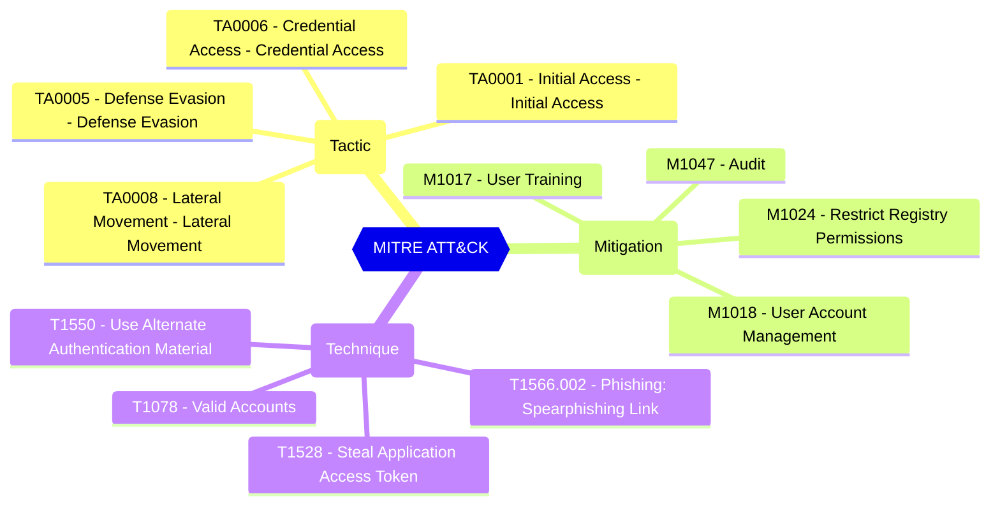

# Default Authorization Settings - Default User Role Permissions - Allowed to create Apps

Controls if non-admin users may register custom-developed applications for use within this directory.

| | |
|-|-|
| **Name** | allowedToCreateApps |
| **Control** | Default Authorization Settings |
| **Description** | Manages authorization settings in Azure AD |
| **Severity** | High |

## How to fix

### Details of configuration item
| | |
|-|-|
| **Recommendation** | CISA SCuBA 2.6: Only Administrators SHALL Be Allowed To Register Third-Party Applications |
| **Configuration** | policies/authorizationPolicy |
| **Setting** | `defaultUserRolePermissions.allowedToCreateApps` |
| **Recommended Value** | 'false' |
| **Default Value** | true |
| **Graph API Docs** | [authorizationPolicy resource type - Microsoft Graph v1.0 - Microsoft Learn](https://learn.microsoft.com/en-us/graph/api/resources/authorizationpolicy) |
| **Graph Explorer** | [Open in Graph Explorer](https://developer.microsoft.com/en-us/graph/graph-explorer?request=policies/authorizationPolicy&method=GET&version=beta&GraphUrl=https://graph.microsoft.com) |

## MITRE ATT&CK

|Tactic|Technique|Mitigation|
|---|---|---|
|[TA0001 - Initial Access - Initial Access](https://attack.mitre.org/tactics/TA0001) [TA0005 - Defense Evasion - Defense Evasion](https://attack.mitre.org/tactics/TA0005) [TA0006 - Credential Access - Credential Access](https://attack.mitre.org/tactics/TA0006) [TA0008 - Lateral Movement - Lateral Movement](https://attack.mitre.org/tactics/TA0008)|[T1566.002 - Phishing: Spearphishing Link](https://attack.mitre.org/techniques/T1566/002) [T1078 - Valid Accounts](https://attack.mitre.org/techniques/T1078) [T1550 - Use Alternate Authentication Material](https://attack.mitre.org/techniques/T1550) [T1528 - Steal Application Access Token](https://attack.mitre.org/techniques/T1528)|[M1017 - User Training](https://attack.mitre.org/mitigations/M1017) [M1018 - User Account Management](https://attack.mitre.org/mitigations/M1018) [M1024 - Restrict Registry Permissions](https://attack.mitre.org/mitigations/M1024) [M1047 - Audit](https://attack.mitre.org/mitigations/M1047)|

