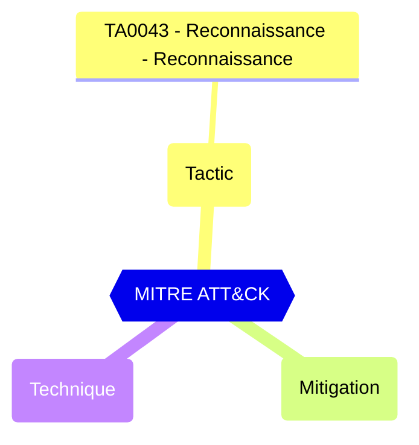

<!-- This file is generated by website/scripts/generate-test-docs.mjs. Do not edit manually. -->

# EIDSCA.AP14 - Default Authorization Settings - Default User Role Permissions - Allowed to read other users.

<div className="test-byline"><div className="test-byline-avatars"><a className="test-byline-avatar test-byline-avatar--author" href="/contributors/cloud-architekt" title="Thomas Naunheim · Original author"></a></div><div className="test-byline-meta"><span className="test-byline-text">Contributed by <a href="/contributors/cloud-architekt">Thomas Naunheim</a></span><a className="test-byline-link" href="/contributors">All contributors →</a></div></div>

## Overview

Prevents all non-admins from reading user information from the directory. This flag doesn't prevent reading user information in other Microsoft services like Exchange Online.

Restrict this default permissions for members have huge impact on collaboration features and user lookup.

#### Test script
```
https://graph.microsoft.com/beta/policies/authorizationPolicy
.defaultUserRolePermissions.allowedToReadOtherUsers -eq 'true'
```

#### Remediation action

Microsoft Graph PowerShell: ```PolicyAuthorizationPolicy -BodyParameter @{DefaultUserRolePermissions = @{AllowedToReadOtherUsers = $false}}```

#### Related links

- [Open in Graph Explorer](https://developer.microsoft.com/graph/graph-explorer?request=policies/authorizationPolicy&method=GET&version=beta&GraphUrl=https://graph.microsoft.com)
- [authorizationPolicy resource type - Microsoft Graph v1.0 | Microsoft Learn](https://learn.microsoft.com/graph/api/resources/authorizationpolicy)


## MITRE ATT&CK


|Tactic|Technique|Mitigation|
|---|---|---|
|[TA0043 - Reconnaissance - Reconnaissance](https://attack.mitre.org/tactics/TA0043)|||

## Test Metadata

| Field | Value |
| --- | --- |
| Test ID | EIDSCA.AP14 |
| Severity | High |
| Suite | Entra ID SCA |
| Category | General |
| PowerShell test | [Test-MtCheckEidscaAP14](https://github.com/maester365/maester/blob/main/tests/EIDSCA/Test.EIDSCA.AP14.ps1) |
| Services | Graph |
| Tags | EIDSCA, EIDSCA.AP14 |

## Source

- Test: [`tests/EIDSCA/Test.EIDSCA.AP14.ps1`](https://github.com/maester365/maester/blob/main/tests/EIDSCA/Test.EIDSCA.AP14.ps1)
- Documentation: [`tests/EIDSCA/Test.EIDSCA.AP14.md`](https://github.com/maester365/maester/blob/main/tests/EIDSCA/Test.EIDSCA.AP14.md)
