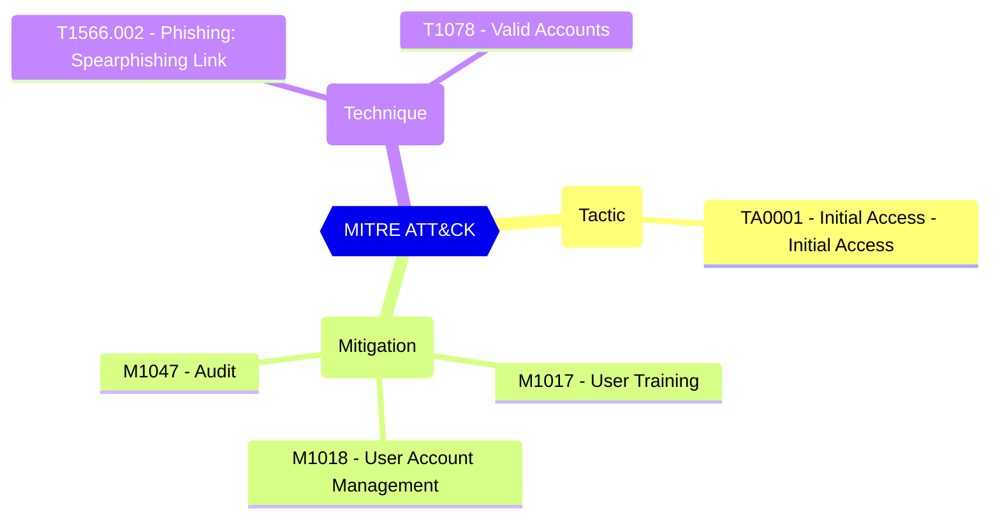

# Default Settings - Consent Policy Settings - Block user consent for risky apps

Defines whether user consent will be blocked when a risky request is detected

| | |
|-|-|
| **Name** | BlockUserConsentForRiskyApps |
| **Control** | Default Settings - Consent Policy Settings |
| **Description** | Define the consent configurations that can be used to customize the tenant-wide and object-specific restrictions and allowed behavior |
| **Severity** | High |

## How to fix

### Details of configuration item
| | |
|-|-|
| **Recommendation** | [Configure risk-based step-up consent - Microsoft Entra ID - Microsoft Learn](https://learn.microsoft.com/en-us/azure/active-directory/manage-apps/configure-risk-based-step-up-consent) |
| **Configuration** | settings |
| **Setting** | `values | where-object name -eq 'BlockUserConsentForRiskyApps' | select-object -expand value` |
| **Recommended Value** | 'true' |
| **Default Value** | true |
| **Graph API Docs** | [directorySetting resource type - Microsoft Graph beta - Microsoft Learn](https://learn.microsoft.com/en-us/graph/api/resources/directorysetting) |
| **Graph Explorer** | [Open in Graph Explorer](https://developer.microsoft.com/en-us/graph/graph-explorer?request=settings&method=GET&version=beta&GraphUrl=https://graph.microsoft.com) |

## MITRE ATT&CK

|Tactic|Technique|Mitigation|
|---|---|---|
|[TA0001 - Initial Access - Initial Access](https://attack.mitre.org/tactics/TA0001)|[T1566.002 - Phishing: Spearphishing Link](https://attack.mitre.org/techniques/T1566/002) [T1078 - Valid Accounts](https://attack.mitre.org/techniques/T1078)|[M1017 - User Training](https://attack.mitre.org/mitigations/M1017) [M1018 - User Account Management](https://attack.mitre.org/mitigations/M1018) [M1047 - Audit](https://attack.mitre.org/mitigations/M1047)|

