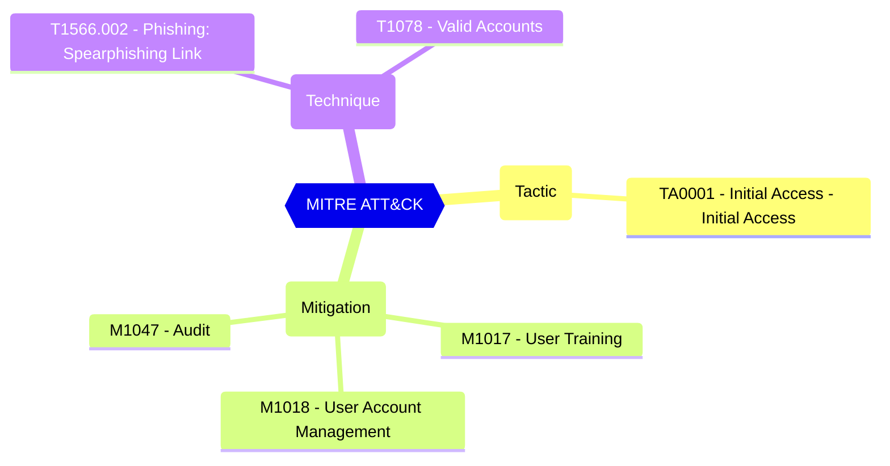

<!-- This file is generated by website/scripts/generate-test-docs.mjs. Do not edit manually. -->

# EIDSCA.CP03 - Default Settings - Consent Policy Settings - Block user consent for risky apps.

## Overview

Defines whether user consent will be blocked when a risky request is detected

[Configure risk-based step-up consent - Microsoft Entra ID - Microsoft Learn](https://learn.microsoft.com/en-us/azure/active-directory/manage-apps/configure-risk-based-step-up-consent)

#### Test script
```
https://graph.microsoft.com/beta/settings
.values -eq 'true'
```

#### Related links

- [Open in Graph Explorer](https://developer.microsoft.com/en-us/graph/graph-explorer?request=settings&method=GET&version=beta&GraphUrl=https://graph.microsoft.com)
- [directorySetting resource type - Microsoft Graph beta | Microsoft Learn](https://learn.microsoft.com/en-us/graph/api/resources/directorysetting)


## MITRE ATT&CK


```mermaid
mindmap
  root{{MITRE ATT&CK}}
    (Tactic)
      TA0001 - Initial Access - Initial Access
    (Mitigation)
      M1017 - User Training
      M1018 - User Account Management
      M1047 - Audit
    (Technique)
      T1566.002 - Phishing: Spearphishing Link
      T1078 - Valid Accounts
```
|Tactic|Technique|Mitigation|
|---|---|---|
|[TA0001 - Initial Access - Initial Access](https://attack.mitre.org/tactics/TA0001)|[T1566.002 - Phishing: Spearphishing Link](https://attack.mitre.org/techniques/T1566/002)<br/>[T1078 - Valid Accounts](https://attack.mitre.org/techniques/T1078)|[M1017 - User Training](https://attack.mitre.org/mitigations/M1017)<br/>[M1018 - User Account Management](https://attack.mitre.org/mitigations/M1018)<br/>[M1047 - Audit](https://attack.mitre.org/mitigations/M1047)|

## Test Metadata

| Field | Value |
| --- | --- |
| Test ID | EIDSCA.CP03 |
| Severity | High |
| Suite | Entra ID SCA |
| Category | General |
| PowerShell test | [Test-MtEidscaCP03](/docs/commands/Test-MtEidscaCP03) |
| Tags | EIDSCA, EIDSCA.CP03 |

## Source

- Pester test: `tests/EIDSCA/Test-EIDSCA.Generated.Tests.ps1`
- PowerShell source: `powershell/internal/eidsca/Test-MtEidscaCP03.ps1`
