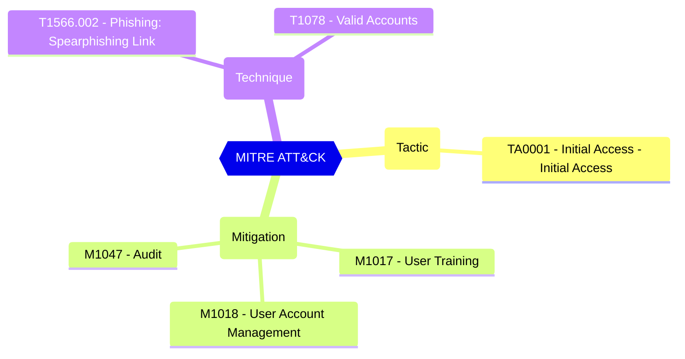

<!-- This file is generated by website/scripts/generate-test-docs.mjs. Do not edit manually. -->

# EIDSCA.CP04 - Default Settings - Consent Policy Settings - Users can request admin consent to apps they are unable to consent to.

## Overview

If this option is set to enabled, then users request admin consent to any app that requires access to data they do not have the permission to grant. If this option is set to disabled, then users must contact their admin to request to consent in order to use the apps they need.

CISA SCuBA 2.7: Non-Admin Users SHALL Be Prevented From Providing Consent To Third-Party Applications.

#### Test script
```
https://graph.microsoft.com/beta/settings
.values -eq 'true'
```

#### Related links

- [Open in Graph Explorer](https://developer.microsoft.com/en-us/graph/graph-explorer?request=settings&method=GET&version=beta&GraphUrl=https://graph.microsoft.com)
- [directorySetting resource type - Microsoft Graph beta | Microsoft Learn](https://learn.microsoft.com/en-us/graph/api/resources/directorysetting)
- [View in Microsoft Entra admin center](https://entra.microsoft.com/#view/Microsoft_AAD_IAM/ConsentPoliciesMenuBlade/~/AdminConsentSettings)

## MITRE ATT&CK


|Tactic|Technique|Mitigation|
|---|---|---|
|[TA0001 - Initial Access - Initial Access](https://attack.mitre.org/tactics/TA0001)|[T1566.002 - Phishing: Spearphishing Link](https://attack.mitre.org/techniques/T1566/002)<br/>[T1078 - Valid Accounts](https://attack.mitre.org/techniques/T1078)|[M1017 - User Training](https://attack.mitre.org/mitigations/M1017)<br/>[M1018 - User Account Management](https://attack.mitre.org/mitigations/M1018)<br/>[M1047 - Audit](https://attack.mitre.org/mitigations/M1047)|

## Test Metadata

| Field | Value |
| --- | --- |
| Test ID | EIDSCA.CP04 |
| Severity | Medium |
| Suite | Entra ID SCA |
| Category | General |
| PowerShell test | [Test-MtEidscaCP04](/docs/commands/Test-MtEidscaCP04) |
| Tags | EIDSCA, EIDSCA.CP04 |

## Source

- Pester test: `tests/EIDSCA/Test-EIDSCA.Generated.Tests.ps1`
- PowerShell source: `powershell/internal/eidsca/Test-MtEidscaCP04.ps1`
