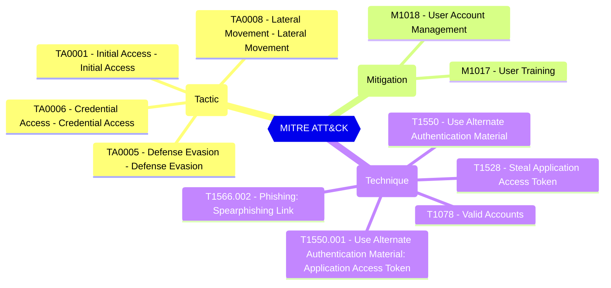

# Consent Framework - Admin Consent Request - Policy to enable or disable admin consent request feature

Defines if admin consent request feature is enabled or disabled

| | |
|-|-|
| **Name** | isEnabled |
| **Control** | Consent Framework - Admin Consent Request |
| **Description** | Represents the policy for enabling or disabling the Azure AD admin consent workflow. The admin consent workflow allows users to request access for apps that they wish to use and that require admin authorization before users can use the apps to access organizational data.  |
| **Severity** |  |

## How to fix

### Details of configuration item
| | |
|-|-|
| **Recommendation** |  |
| **Configuration** | policies/adminConsentRequestPolicy |
| **Setting** | `isEnabled` |
| **Recommended Value** | 'true' |
| **Default Value** | false |
| **Graph API Docs** | [adminConsentRequestPolicy resource type - Microsoft Graph v1.0 - Microsoft Learn](https://learn.microsoft.com/en-us/graph/api/resources/adminconsentrequestpolicy) |
| **Graph Explorer** | [Open in Graph Explorer](https://developer.microsoft.com/en-us/graph/graph-explorer?request=policies/adminConsentRequestPolicy&method=GET&version=beta&GraphUrl=https://graph.microsoft.com) |

## MITRE ATT&CK

|Tactic|Technique|Mitigation|
|---|---|---|
|[TA0001 - Initial Access - Initial Access](https://attack.mitre.org/tactics/TA0001) [TA0005 - Defense Evasion - Defense Evasion](https://attack.mitre.org/tactics/TA0005) [TA0006 - Credential Access - Credential Access](https://attack.mitre.org/tactics/TA0006) [TA0008 - Lateral Movement - Lateral Movement](https://attack.mitre.org/tactics/TA0008)|[T1078 - Valid Accounts](https://attack.mitre.org/techniques/T1078) [T1528 - Steal Application Access Token](https://attack.mitre.org/techniques/T1528) [T1550 - Use Alternate Authentication Material](https://attack.mitre.org/techniques/T1550) [T1550.001 - Use Alternate Authentication Material: Application Access Token](https://attack.mitre.org/techniques/T1550/001) [T1566.002 - Phishing: Spearphishing Link](https://attack.mitre.org/techniques/T1566/002)|[M1018 - User Account Management](https://attack.mitre.org/mitigations/M1018) [M1017 - User Training](https://attack.mitre.org/mitigations/M1017)|

