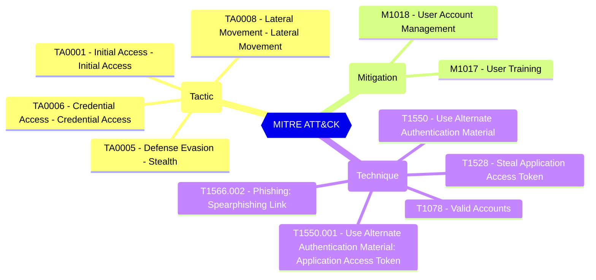

<!-- This file is generated by website/scripts/generate-test-docs.mjs. Do not edit manually. -->

# EIDSCA.CR01 - Consent Framework - Admin Consent Request - Policy to enable or disable admin consent request feature.

## Overview

Defines if admin consent request feature is enabled or disabled


#### Test script
```
https://graph.microsoft.com/beta/policies/adminConsentRequestPolicy
.isEnabled -eq 'true'
```

#### Related links

- [Open in Graph Explorer](https://developer.microsoft.com/en-us/graph/graph-explorer?request=policies/adminConsentRequestPolicy&method=GET&version=beta&GraphUrl=https://graph.microsoft.com)
- [adminConsentRequestPolicy resource type - Microsoft Graph v1.0 | Microsoft Learn](https://learn.microsoft.com/en-us/graph/api/resources/adminconsentrequestpolicy)
- [View in Microsoft Entra admin center](https://entra.microsoft.com/#view/Microsoft_AAD_IAM/ConsentPoliciesMenuBlade/~/AdminConsentSettings)

## MITRE ATT&CK


```mermaid
mindmap
  root{{MITRE ATT&CK}}
    (Tactic)
      TA0001 - Initial Access - Initial Access
      TA0005 - Defense Evasion - Stealth
      TA0006 - Credential Access - Credential Access
      TA0008 - Lateral Movement - Lateral Movement
    (Mitigation)
      M1018 - User Account Management
      M1017 - User Training
    (Technique)
      T1078 - Valid Accounts
      T1528 - Steal Application Access Token
      T1550 - Use Alternate Authentication Material
      T1550.001 - Use Alternate Authentication Material: Application Access Token
      T1566.002 - Phishing: Spearphishing Link
```
|Tactic|Technique|Mitigation|
|---|---|---|
|[TA0001 - Initial Access - Initial Access](https://attack.mitre.org/tactics/TA0001)<br/>[TA0005 - Defense Evasion - Stealth](https://attack.mitre.org/tactics/TA0005)<br/>[TA0006 - Credential Access - Credential Access](https://attack.mitre.org/tactics/TA0006)<br/>[TA0008 - Lateral Movement - Lateral Movement](https://attack.mitre.org/tactics/TA0008)|[T1078 - Valid Accounts](https://attack.mitre.org/techniques/T1078)<br/>[T1528 - Steal Application Access Token](https://attack.mitre.org/techniques/T1528)<br/>[T1550 - Use Alternate Authentication Material](https://attack.mitre.org/techniques/T1550)<br/>[T1550.001 - Use Alternate Authentication Material: Application Access Token](https://attack.mitre.org/techniques/T1550/001)<br/>[T1566.002 - Phishing: Spearphishing Link](https://attack.mitre.org/techniques/T1566/002)|[M1018 - User Account Management](https://attack.mitre.org/mitigations/M1018)<br/>[M1017 - User Training](https://attack.mitre.org/mitigations/M1017)|

## Test Metadata

| Field | Value |
| --- | --- |
| Test ID | EIDSCA.CR01 |
| Severity | High |
| Suite | Entra ID SCA |
| Category | General |
| PowerShell test | [Test-MtEidscaCR01](/docs/commands/Test-MtEidscaCR01) |
| Tags | EIDSCA, EIDSCA.CR01 |

## Source

- Pester test: `tests/EIDSCA/Test-EIDSCA.Generated.Tests.ps1`
- PowerShell source: `powershell/internal/eidsca/Test-MtEidscaCR01.ps1`
