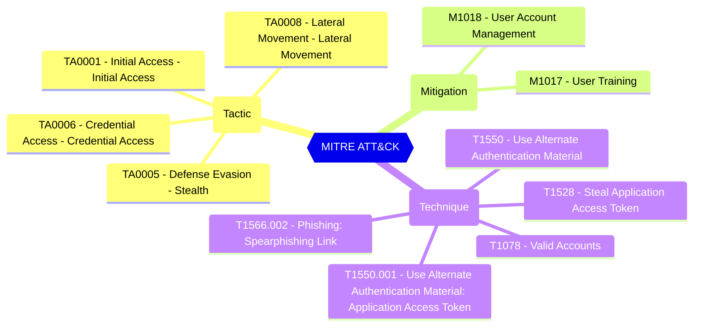

<!-- This file is generated by website/scripts/generate-test-docs.mjs. Do not edit manually. -->

# EIDSCA.CR03 - Consent Framework - Admin Consent Request - Reviewers will receive email notifications when admin consent requests are about to expire.

<div className="test-byline"><div className="test-byline-avatars"><a className="test-byline-avatar test-byline-avatar--author" href="/contributors/cloud-architekt" title="Thomas Naunheim · Original author"></a></div><div className="test-byline-meta"><span className="test-byline-text">Contributed by <a href="/contributors/cloud-architekt">Thomas Naunheim</a></span><a className="test-byline-link" href="/contributors">All contributors →</a></div></div>

## Overview

Specifies whether reviewers will receive reminder emails


#### Test script
```
https://graph.microsoft.com/beta/policies/adminConsentRequestPolicy
.remindersEnabled -eq 'true'
```


#### Related links

- [Open in Graph Explorer](https://developer.microsoft.com/graph/graph-explorer?request=policies/adminConsentRequestPolicy&method=GET&version=beta&GraphUrl=https://graph.microsoft.com)
- [adminConsentRequestPolicy resource type - Microsoft Graph v1.0 | Microsoft Learn](https://learn.microsoft.com/graph/api/resources/adminconsentrequestpolicy)
- [View in Microsoft Entra admin center](https://entra.microsoft.com/#view/Microsoft_AAD_IAM/ConsentPoliciesMenuBlade/~/AdminConsentSettings)

## MITRE ATT&CK


|Tactic|Technique|Mitigation|
|---|---|---|
|[TA0001 - Initial Access - Initial Access](https://attack.mitre.org/tactics/TA0001)<br/>[TA0005 - Defense Evasion - Stealth](https://attack.mitre.org/tactics/TA0005)<br/>[TA0006 - Credential Access - Credential Access](https://attack.mitre.org/tactics/TA0006)<br/>[TA0008 - Lateral Movement - Lateral Movement](https://attack.mitre.org/tactics/TA0008)|[T1078 - Valid Accounts](https://attack.mitre.org/techniques/T1078)<br/>[T1528 - Steal Application Access Token](https://attack.mitre.org/techniques/T1528)<br/>[T1550 - Use Alternate Authentication Material](https://attack.mitre.org/techniques/T1550)<br/>[T1550.001 - Use Alternate Authentication Material: Application Access Token](https://attack.mitre.org/techniques/T1550/001)<br/>[T1566.002 - Phishing: Spearphishing Link](https://attack.mitre.org/techniques/T1566/002)|[M1018 - User Account Management](https://attack.mitre.org/mitigations/M1018)<br/>[M1017 - User Training](https://attack.mitre.org/mitigations/M1017)|

## Test Metadata

| Field | Value |
| --- | --- |
| Test ID | EIDSCA.CR03 |
| Severity | Medium |
| Suite | Entra ID SCA |
| Category | General |
| PowerShell test | [Test-MtCheckEidscaCR03](https://github.com/maester365/maester/blob/main/tests/EIDSCA/Test.EIDSCA.CR03.ps1) |
| Services | Graph |
| Tags | EIDSCA, EIDSCA.CR03 |

## Source

- Test: [`tests/EIDSCA/Test.EIDSCA.CR03.ps1`](https://github.com/maester365/maester/blob/main/tests/EIDSCA/Test.EIDSCA.CR03.ps1)
- Documentation: [`tests/EIDSCA/Test.EIDSCA.CR03.md`](https://github.com/maester365/maester/blob/main/tests/EIDSCA/Test.EIDSCA.CR03.md)
