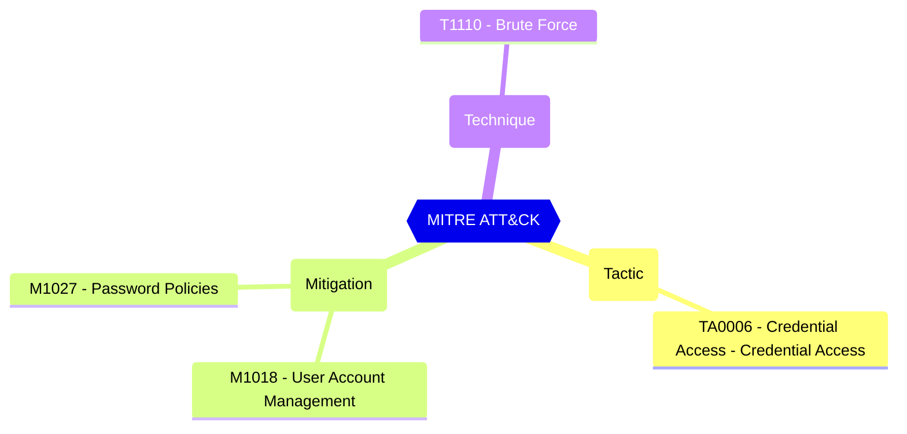

<!-- This file is generated by website/scripts/generate-test-docs.mjs. Do not edit manually. -->

# EIDSCA.PR01 - Default Settings - Password Rule Settings - Password Protection - Mode.

<div className="test-byline"><div className="test-byline-avatars"><a className="test-byline-avatar test-byline-avatar--author" href="/contributors/cloud-architekt" title="Thomas Naunheim · Original author"></a></div><div className="test-byline-meta"><span className="test-byline-text">Contributed by <a href="/contributors/cloud-architekt">Thomas Naunheim</a></span><a className="test-byline-link" href="/contributors">All contributors →</a></div></div>

## Overview

If set to Enforce, users will be prevented from setting banned passwords and the attempt will be logged. If set to Audit, the attempt will only be logged.

[Microsoft Entra Password Protection - Microsoft Entra ID - Microsoft Learn](https://learn.microsoft.com/azure/active-directory/authentication/concept-password-ban-bad-on-premises)

#### Test script
```
https://graph.microsoft.com/beta/settings
.values -eq 'Enforce'
```


#### Related links

- [Open in Graph Explorer](https://developer.microsoft.com/graph/graph-explorer?request=settings&method=GET&version=beta&GraphUrl=https://graph.microsoft.com)
- [directorySetting resource type - Microsoft Graph beta | Microsoft Learn](https://learn.microsoft.com/graph/api/resources/directorysetting)
- [View in Microsoft Entra admin center](https://entra.microsoft.com/#view/Microsoft_AAD_IAM/AuthenticationMethodsMenuBlade/~/PasswordProtection)

## MITRE ATT&CK


|Tactic|Technique|Mitigation|
|---|---|---|
|[TA0006 - Credential Access - Credential Access](https://attack.mitre.org/tactics/TA0006)|[T1110 - Brute Force](https://attack.mitre.org/techniques/T1110)|[M1018 - User Account Management](https://attack.mitre.org/mitigations/M1018)<br/>[M1027 - Password Policies](https://attack.mitre.org/mitigations/M1027)|

## Test Metadata

| Field | Value |
| --- | --- |
| Test ID | EIDSCA.PR01 |
| Severity | High |
| Suite | Entra ID SCA |
| Category | General |
| PowerShell test | [Test-MtCheckEidscaPR01](https://github.com/maester365/maester/blob/main/tests/EIDSCA/Test.EIDSCA.PR01.ps1) |
| Services | Graph |
| Compatible licenses | AAD_PREMIUM |
| Tags | EIDSCA, EIDSCA.PR01 |

## Source

- Test: [`tests/EIDSCA/Test.EIDSCA.PR01.ps1`](https://github.com/maester365/maester/blob/main/tests/EIDSCA/Test.EIDSCA.PR01.ps1)
- Documentation: [`tests/EIDSCA/Test.EIDSCA.PR01.md`](https://github.com/maester365/maester/blob/main/tests/EIDSCA/Test.EIDSCA.PR01.md)
