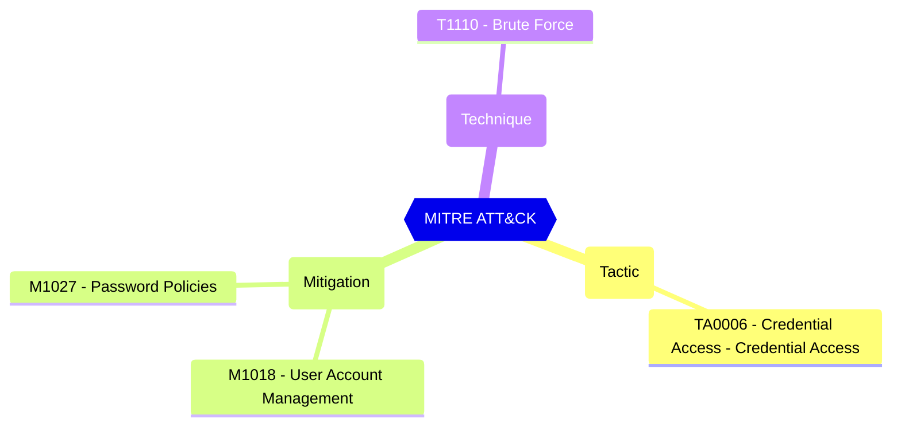

<!-- This file is generated by website/scripts/generate-test-docs.mjs. Do not edit manually. -->

# EIDSCA.PR03 - Default Settings - Password Rule Settings - Enforce custom list.

<div className="test-byline"><div className="test-byline-avatars"><a className="test-byline-avatar test-byline-avatar--author" href="/contributors/cloud-architekt" title="Thomas Naunheim · Original author"></a><a className="test-byline-avatar" href="/contributors/merill" title="Merill Fernando · Co-contributor"></a><a className="test-byline-avatar" href="/contributors/f-bader" title="Fabian Bader · Co-contributor"></a><a className="test-byline-avatar" href="/contributors/samerde" title="Sam Erde · Co-contributor"></a></div><div className="test-byline-meta"><span className="test-byline-text">Contributed by <a href="/contributors/cloud-architekt">Thomas Naunheim</a> with 3 co-contributors</span><a className="test-byline-link" href="/contributors">All contributors →</a></div></div>

## Overview

When enabled, the words in the list below are used in the banned password system to prevent easy-to-guess passwords.

[Password protection in Microsoft Entra ID - Microsoft Entra ID - Microsoft Learn](https://learn.microsoft.com/en-us/azure/active-directory/authentication/concept-password-ban-bad#global-banned-password-list)

#### Test script
```
https://graph.microsoft.com/beta/settings
.values -eq 'True'
```

#### Related links

- [Open in Graph Explorer](https://developer.microsoft.com/en-us/graph/graph-explorer?request=settings&method=GET&version=beta&GraphUrl=https://graph.microsoft.com)
- [directorySetting resource type - Microsoft Graph beta | Microsoft Learn](https://learn.microsoft.com/en-us/graph/api/resources/directorysetting)
- [View in Microsoft Entra admin center](https://entra.microsoft.com/#view/Microsoft_AAD_IAM/AuthenticationMethodsMenuBlade/~/PasswordProtection)

## MITRE ATT&CK


|Tactic|Technique|Mitigation|
|---|---|---|
|[TA0006 - Credential Access - Credential Access](https://attack.mitre.org/tactics/TA0006)|[T1110 - Brute Force](https://attack.mitre.org/techniques/T1110)|[M1018 - User Account Management](https://attack.mitre.org/mitigations/M1018)<br/>[M1027 - Password Policies](https://attack.mitre.org/mitigations/M1027)|

## Test Metadata

| Field | Value |
| --- | --- |
| Test ID | EIDSCA.PR03 |
| Severity | Medium |
| Suite | Entra ID SCA |
| Category | General |
| PowerShell test | [Test-MtEidscaPR03](/docs/commands/Test-MtEidscaPR03) |
| Tags | EIDSCA, EIDSCA.PR03 |

## Source

- Pester test: `tests/EIDSCA/Test-EIDSCA.Generated.Tests.ps1`
- PowerShell source: `powershell/internal/eidsca/Test-MtEidscaPR03.ps1`
