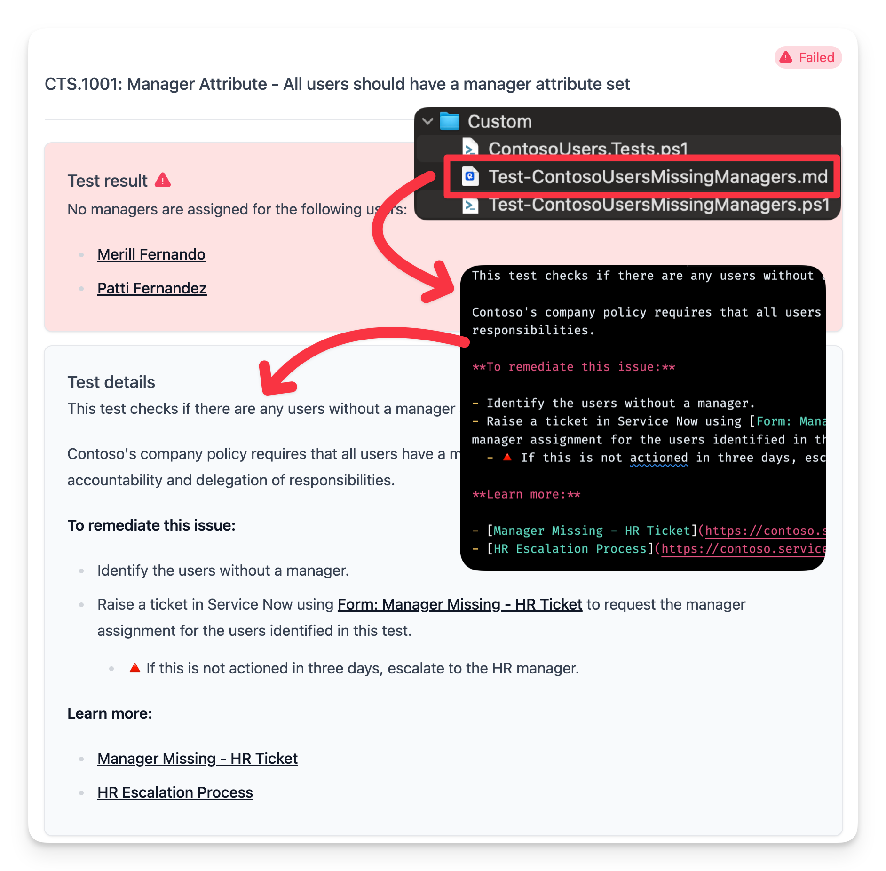

## Overview

In this guide we will cover advanced concepts for writing custom tests with Maester.

## Invoke-MtGraphRequest

Maester provides a function called `Invoke-MtGraphRequest` that allows you to make direct calls to the Microsoft Graph API. This is an enhanced version of the `Invoke-MgGraphRequest` function that has been optimized for Maester's use case to query Microsoft Graph data.

Here's an example of how you can use `Invoke-MtGraphRequest` to get all the users in your tenant.

```powershell
$users = Invoke-MtGraphRequest -RelativeUri "users"
```

### Caching: Invoke-MtGraphRequest's secret sauce

`Invoke-MtGraphRequest` has built-in caching to reduce the number of calls to the Microsoft Graph API when running Maester tests.

This way you can write tests that call into any Graph API and if that data has already been fetched in the Maester run, the cached data will be used instead of querying Microsoft Graph. This is one of the reasons we can run multiple tests in a very performant way.

The cache is reset when you run Invoke-Maester to ensure you always have the latest data.

If your tests use Graph cmdlets like `Get-MgUser`, they will not benefit from this caching mechanism and will make a call to the Graph API every time they are run.

### Other key features of `Invoke-MtGraphRequest`

In addition to caching, `Invoke-MtGraphRequest` has other key features that make it very easy to write tests that query data.

- Automatically handles pagination and gets all of the users by default (you don't need to specify -All)
- Includes **ConsistencyLevel** by default to all the calls. This works for Maester's read-only use case and allows you to use any of the advanced query filter options without worrying about the consistency flag.
- Provides automatic support for batching by passing in an array of object IDs to the `-UniqueId` parameter.
- Named parameters for `Select`, `Filter` and `QueryParameters` make it easier to write complex queries.

Here are a few examples.

#### Get selected list of users with specific properties

Use the `UniqueId` parameter to get specific users by their object ID and select only the properties you need.

The $usersIds array can have one or hundreds of object IDs. Invoke-MtGraphRequest will optimize the calls by batching and paging through the results.

```powershell
$userIds = @($globalAdministrators.Id)

Write-Verbose "Requesting users onPremisesSyncEnabled property"
$users = Invoke-MtGraphRequest -RelativeUri "users" -UniqueId $userIds -Select id, displayName, onPremisesSyncEnabled

```

#### Specify api version, filters, query parameters with expand

This example shows how you can splat the code to make it easier to read when you have a complex query.

```powershell
$policySplat = @{
    ApiVersion      = "beta"
    RelativeUri     = "policies/roleManagementPolicyAssignments"
    Filter          = "scopeId eq '/' and scopeType eq 'DirectoryRole' and roleDefinitionId eq '$($globalAdministratorsRole.id)'"
    QueryParameters = @{
        expand = "policy(expand=rules)"
    }
}
$policy = Invoke-MtGraphRequest @policySplat
```

To learn more see [Invoke-MtGraphRequest](https://github.com/maester365/maester/blob/main/powershell/public/Invoke-MtGraphRequest.ps1).

## Gating tests on license availability

Some tests only make sense when the tenant has a specific license. Rather than letting those tests fail or produce misleading results on unlicensed tenants, you can skip them cleanly at Pester discovery time using `Get-MtSessionLicense` and a `BeforeDiscovery` block.

### Get-MtSessionLicense

`Get-MtSessionLicense` returns a hashtable of all license products evaluated for the current tenant. The map is populated once by `Initialize-MtSession` when `Invoke-Maester` starts, so calling it inside a `BeforeDiscovery` block costs zero additional Graph API calls.

The keys match the `-Product` parameter of `Get-MtLicenseInformation`:

| Key               | Possible values                            |
| ----------------- | ------------------------------------------ |
| `EntraID`         | `'Free'`, `'P1'`, `'P2'`, `'Governance'`   |
| `EntraWorkloadID` | `'P1'`, `'P2'`, or `$null` if not licensed |
| `Eop`             | `'Eop'` or `$null`                         |
| `Mdo`             | plan string or `$null`                     |
| `Intune`          | `'Intune'` or `$null`                      |
| `DefenderXDR`     | plan string or `$null`                     |
| `CustomerLockbox` | plan string or `$null`                     |
| *(others)*        | plan string or `$null`                     |

### BeforeDiscovery skip pattern

Place `Get-MtSessionLicense` inside a `BeforeDiscovery` block at the top of the test file. Variables set there are available to `-Skip:()` expressions on `Describe` and `It` blocks.

```powershell
BeforeDiscovery {
    $Licenses = Get-MtSessionLicense
}

Describe "Contoso" -Tag "Entra", "License-EntraP2" -Skip:($Licenses.EntraID -notin 'P2', 'Governance') {
    It "CTS.2001: Some P2-only check" -Tag "CTS.2001" {
        Test-ContosoSomeP2Feature | Should -Be $true
    }
}
```

Use this pattern for each license tier:

| Requirement               | `-Skip:()` expression                                 |
| ------------------------- | ----------------------------------------------------- |
| Entra ID P1 or above      | `-Skip:($Licenses.EntraID -eq 'Free')`                |
| Entra ID P2 or Governance | `-Skip:($Licenses.EntraID -notin 'P2', 'Governance')` |
| Intune                    | `-Skip:($null -eq $Licenses.Intune)`                  |
| Defender XDR              | `-Skip:($null -eq $Licenses.DefenderXDR)`             |

### License tags

Add the corresponding `License-*` tag to every `Describe` (or `It`) block that uses a license skip. This enables `Invoke-Maester -AutoFilterLicense` to exclude the block entirely via tag filtering before discovery — a faster path on unlicensed tenants.

| License requirement           | Tag to add                |
| ----------------------------- | ------------------------- |
| Entra ID P1                   | `License-EntraP1`         |
| Entra ID P2                   | `License-EntraP2`         |
| Entra ID Governance           | `License-EntraGovernance` |
| Entra Workload ID             | `License-EntraWorkloadID` |
| Exchange Online Protection    | `License-Eop`             |
| Microsoft Defender for Office | `License-Mdo`             |
| Advanced Audit                | `License-AdvAudit`        |
| Defender XDR                  | `License-DefenderXDR`     |
| Customer Lockbox              | `License-CustomerLockbox` |
| Intune                        | `License-Intune`          |

## Splitting tests into multiple files

As you write more tests you might find it helpful to split out the markdown part of the tests into a separate file. This helps reduce clutter in the test code and also allows content writers to independently edit the markdown files. Almost all the out of the box Maester tests use this approach of splitting out the markdown content for the test.

Here's an example of how you can split out the markdown content into a separate file.

This custom test checks if there are any users without a manager assigned.

### Step 1: Create the tests file in the `Custom` folder

Create a new file in the `Custom` folder with the `.Tests.ps1` suffix.

#### ContosoUsers.Tests.ps1

```powershell
BeforeAll {
    . $PSScriptRoot/Test-ContosoUsersMissingManagers.ps1
}
Describe "Contoso" -Tag "Entra", "CustomTests", "Users" {
    It "CTS.1001: Manager Attribute - All users should have a manager attribute set" {
        $result = Test-ContosoUsersMissingManagers
        $result | Should -Be $true -Because "All users should have a manager assigned."
    }
}
```

### Step 2: Create test functions file

Create the test file in the `Custom` folder that was referred to in the `BeforeAll` block in the previous step.

#### Test-ContosoUsersMissingManagers.ps1

```powershell
function Test-ContosoUsersMissingManagers {
    $result = $true

    try {
        # Retrieve all users from Microsoft Graph
        $users = Invoke-MtGraphRequest -RelativeUri "users" -Filter "userType eq 'Member'"

        # Initialize an array to track users without a manager
        $usersWithoutManager = @()

        # Loop through each user and ensure they have a manager assigned
        foreach ($user in $users) {
            if($user.jobTitle -eq "CEO" -or $user.displayName -eq "On-Premises Directory Synchronization Service Account" ) {
                continue
            }

            # Fetch the manager for the current user
            $manager = Get-MgUserManager -UserId $user.Id -ErrorAction SilentlyContinue

            if ([string]::IsNullOrEmpty($manager)) {
                $result = $false
                $usersWithoutManager += $user
            }
        }

        if ($result) {
            $TestResults = "Well done! There were no users with out managers assigned."
        } else {
            $TestResults += "No managers are assigned for the following users.`n%TestResult%"
        }

        Add-MtTestResultDetail -Result $TestResults -GraphObjects $usersWithoutManager -GraphObjectType Users
        return $result
    } catch {
        Add-MtTestResultDetail -SkippedBecause Error -SkippedError $_
        return $null
    }
}
```

:::note
To use the markdown content from the file, **do not** include the `-Description` parameter when calling `Add-MtTestResultDetail`.
:::

##### Error handling

Always include your main code within a try catch block. In the catch block, use `Add-MtTestResultDetail -SkippedBecause Error -SkippedError $_` to log the error and return `$null` to indicate that the test could not be run.

:::note
Do not call `Add-MtTestResultDetail` with a `-SkippedBecause` parameter within the try block. This will result in the test being reported as an error instead of skipped. To avoid this, close the try block before calling `Add-MtTestResultDetail` with the `-SkippedBecause` parameter and then start a new try block to continue the main test logic. This is the way Pester handles skipped tests and errors.
:::

##### Tests that don't support application permissions

Some tests may rely on Graph APIs that don't support application permissions. In these cases, you can use the `Add-MtTestResultDetail -SkippedBecause 'NotSupportedAppPermission'` to indicate that the test was skipped due to this limitation.

Use this code block to perform the check.

```powershell
if (((Get-MgContext).AuthType) -ne "Delegated") {
    Add-MtTestResultDetail -SkippedBecause 'NotSupportedAppPermission'
    return $null
}
```

### Step 3: Create the markdown file

Create a markdown file in the `Custom` folder **with the same name as the test file** but with the `.md` extension.

#### Test-ContosoUsersMissingManagers.md

```md
This test checks if there are any users without a manager assigned.

Contoso's company policy requires that all users have a manager assigned to them. This is important for accountability and delegation of responsibilities.

**To remediate this issue:**

- Identify the users without a manager.
- Raise a ticket in Service Now using [Form: Manager Missing - HR Ticket](https://contoso.service-now.com/managermissing) to request the manager assignment for the users identified in this test.
  - 🔺 If this is not actioned in three days, escalate to the HR manager.

**Learn more:**

- [Manager Missing - HR Ticket](https://contoso.service-now.com/managermissing)
- [HR Escalation Process](https://contoso.service-now.com/hrescalation)

<!--- Results --->

%TestResult%

```

### Step 4: Run the test

Running the test should now show the markdown content in the test results.


