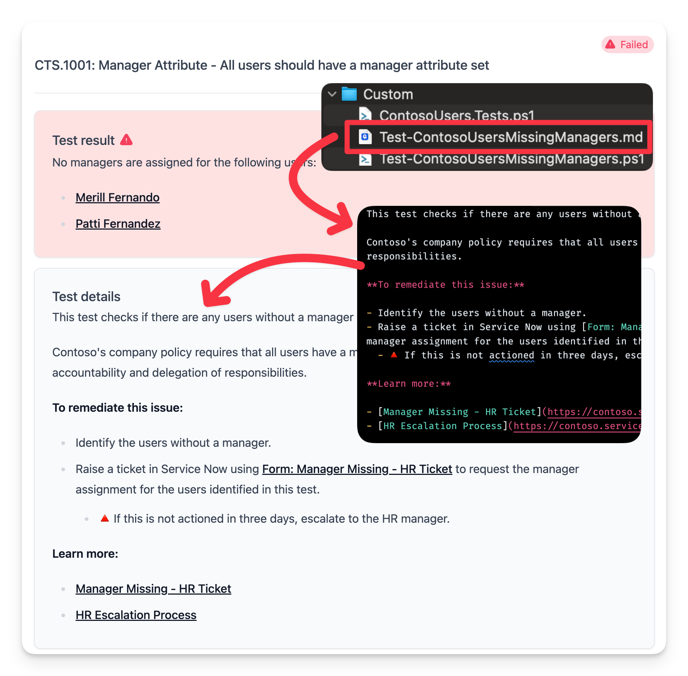

## Overview

In this guide we will cover advanced concepts for writing custom tests with Maester.

## Invoke-MtGraphRequest

Maester provides a function called `Invoke-MtGraphRequest` that allows you to make direct calls to the Microsoft Graph API. This is an enhanced version of the `Invoke-MgGraphRequest` function that has been optimized for Maester's use case to query Microsoft Graph data.

Here's an example of how you can use `Invoke-MtGraphRequest` to get all the users in your tenant.

```powershell
$users = Invoke-MtGraphRequest -RelativeUri "users"
```

### Caching: Invoke-MtGraphRequest's secret sauce

`Invoke-MtGraphRequest` has built-in caching to reduce the number of calls to the Microsoft Graph API when running Maester tests.

This way you can write tests that call into any Graph API and if that data has already been fetched in the Maester run, the cached data will be used instead of querying Microsoft Graph. This is one of the reasons we can run multiple tests in a very performant way.

The cache is reset when you run Invoke-Maester to ensure you always have the latest data.

If your tests use Graph cmdlets like `Get-MgUser`, they will not benefit from this caching mechanism and will make a call to the Graph API every time they are run.

### Other key features of `Invoke-MtGraphRequest`:

In addition to caching, `Invoke-MtGraphRequest` has other key features that make it very easy to write tests that query data.

- Automatically handles pagination and gets all of the users by default (you don't need to specify -All)
- Includes **ConsistencyLevel** by default to all the calls. This works for Maester's read-only use case and allows you to use any of the advanced query filter options without worrying about the consistency flag.
- Provides automatic support for batching by passing in an array of object IDs to the `-UniqueId` parameter.
- Named parameters for `Select`, `Filter` and `QueryParameters` make it easier to write complex queries.

Here are a few examples.

#### Get selected list of users with specific properties

Use the `UniqueId` parameter to get specific users by their object ID and select only the properties you need.

The $usersIds array can have one or hundreds of object IDs. Invoke-MtGraphRequest will optimize the calls by batching and paging through the results.

```powershell
$userIds = @($globalAdministrators.Id)

Write-Verbose "Requesting users onPremisesSyncEnabled property"
$users = Invoke-MtGraphRequest -RelativeUri "users" -UniqueId $userIds -Select id, displayName, onPremisesSyncEnabled

```

#### Specify api version, filters, query parameters with expand

This example shows how you can splat the code to make it easier to read when you have a complex query.

```powershell
$policySplat = @{
    ApiVersion      = "beta"
    RelativeUri     = "policies/roleManagementPolicyAssignments"
    Filter          = "scopeId eq '/' and scopeType eq 'DirectoryRole' and roleDefinitionId eq '$($globalAdministratorsRole.id)'"
    QueryParameters = @{
        expand = "policy(expand=rules)"
    }
}
$policy = Invoke-MtGraphRequest @policySplat
```

To learn more see [Invoke-MtGraphRequest](https://github.com/maester365/maester/blob/main/powershell/public/services/graph/Invoke-MtGraphRequest.ps1).

## Markdown, helpers and shared code

A native test is always split into two files: the code in `Test.<ID>.ps1` and the description, remediation steps and result template in `Test.<ID>.md`. Content writers can edit the `.md` file without touching the code. See [Writing native tests](./index.mdx) for the full format.

Here's a custom test that checks if there are any users without a manager assigned.

### Step 1: Create the test

```powershell
New-MtTest -Id CONTOSO.1101 -Title 'All users should have a manager attribute set' -Service Graph -Category Contoso
```

### Step 2: Write the test function

#### Custom/Test.CONTOSO.1101.ps1

```powershell
function Test-ContosoUsersMissingManagers {
    [MaesterTest(
        Id       = 'CONTOSO.1101',
        Title    = 'All users should have a manager attribute set',
        Severity = 'Low',
        Category = 'Contoso',
        Tag      = ('Entra', 'Users'),
        Service  = 'Graph'
    )]
    [CmdletBinding()]
    [OutputType([bool])]
    param(
        # Job titles that do not need a manager.
        [string[]] $ExemptJobTitles = @('CEO')
    )

    $users = Invoke-MtGraphRequest -RelativeUri 'users' -Filter "userType eq 'Member'" -Select id, displayName, userPrincipalName, jobTitle
    $usersWithoutManager = @()

    foreach ($user in $users) {
        if ($user.jobTitle -in $ExemptJobTitles -or $user.displayName -eq 'On-Premises Directory Synchronization Service Account') {
            continue
        }
        # Graph answers 404 when a user has no manager. Handling that one case with try/catch is fine;
        # any other error still ends the test as an Error result.
        $manager = try { Get-MgUserManager -UserId $user.id -ErrorAction Stop } catch { $null }
        if (-not $manager) {
            $usersWithoutManager += $user
        }
    }

    if ($usersWithoutManager.Count -eq 0) {
        Add-MtTestResultDetail -Result 'Well done! There were no users without managers assigned.'
        return $true
    }

    Add-MtTestResultDetail -Result "No managers are assigned for the following users.`n`n%TestResult%" -GraphObjects $usersWithoutManager -GraphObjectType Users
    return $false
}
```

A few things to notice:

- There is no outer `try`/`catch`. The engine runs every test inside its own error handler: an uncaught error ends the test and is reported as `Error` with the message. Use `try`/`catch` only for a case you handle, as with the missing manager above.
- There is no `Test-MtConnection` check. `Service = 'Graph'` makes the engine skip the test when Graph is not connected.
- `$ExemptJobTitles` is a parameter, so each tenant can set it in `maester-config.json` (`TestSettings` > `Parameters`) without changing the code.

:::note
To use the markdown content from the `.md` file, **do not** include the `-Description` parameter when calling `Add-MtTestResultDetail`.
:::

##### Tests that don't support application permissions

Some tests rely on Graph APIs that don't support application permissions. Skip them when Maester runs with an application identity:

```powershell
if (((Get-MgContext).AuthType) -ne "Delegated") {
    Add-MtTestResultDetail -SkippedBecause 'NotSupportedAppPermission'
}
```

`Add-MtTestResultDetail -SkippedBecause` ends the test, so no `return` is needed after it. It works inside a `try` block too.

##### Sharing code between tests

Functions defined in the same `Test.<ID>.ps1` file are available to the test. To share code between several test files, put it in a helper file whose name does not start with `Test.` (for example `Contoso.Helpers.ps1`) and dot-source it from inside the test function:

```powershell
. "$PSScriptRoot/Contoso.Helpers.ps1"
```

A custom test can call every command Maester exports, but not Maester's private functions.

### Step 3: Write the markdown file

Create the markdown file in the `Custom` folder **with the same name as the test file** but with the `.md` extension.

#### Custom/Test.CONTOSO.1101.md

```md
This test checks if there are any users without a manager assigned.

Contoso's company policy requires that all users have a manager assigned to them. This is important for accountability and delegation of responsibilities.

#### Remediation action

- Identify the users without a manager.
- Raise a ticket in Service Now using [Form: Manager Missing - HR Ticket](https://contoso.service-now.com/managermissing) to request the manager assignment for the users identified in this test.
  - 🔺 If this is not actioned in three days, escalate to the HR manager.

#### Related links

- [Manager Missing - HR Ticket](https://contoso.service-now.com/managermissing)
- [HR Escalation Process](https://contoso.service-now.com/hrescalation)

<!--- Results --->
%TestResult%
```

### Step 4: Run the test

```powershell
Get-MtTest -Path ./Custom/Test.CONTOSO.1101.ps1   # validate it
Invoke-MtTest -Path ./Custom/Test.CONTOSO.1101.ps1
```

Running the test should now show the markdown content in the test results.


