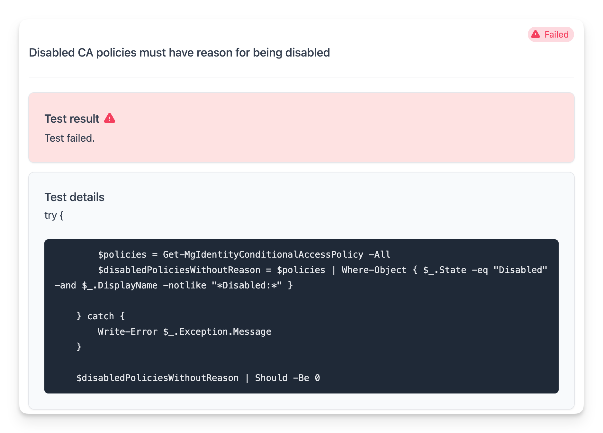
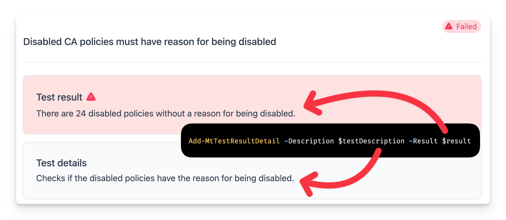
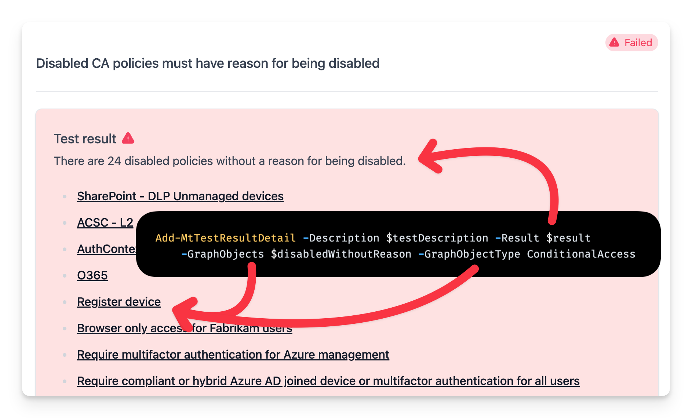
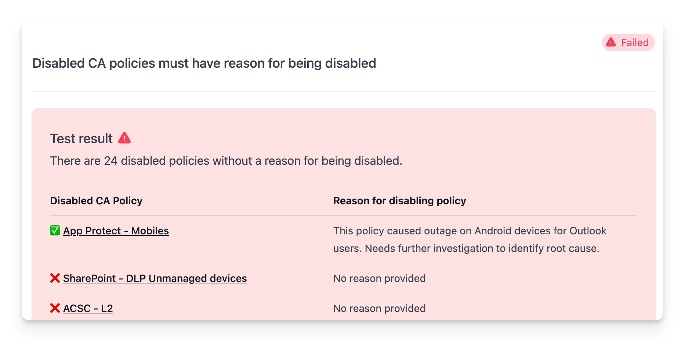

## Overview

In this section we will learn how to format test results to provide more context and make them easier to understand for the person viewing the results.

The examples are [native tests](./index.mdx): a `Test.<ID>.ps1` file in your `custom` folder with a `Test.<ID>.md` file beside it. `Add-MtTestResultDetail` works the same way in [Pester-format tests](./pester-format-tests.md).

Let's write a test to check if conditional access policies are following the company's standards.

## A custom Maester test to check conditional access policies standards

Our organization has a policy that all disabled conditional access policies should include the reason for the policy being disabled. This is done by adding a note to the display name in the format `Disabled: <reason>`.

To check if the conditional access policies are following this standard, we can write the following test. Create it with `New-MtTest -Id CONTOSO.0001 -Title 'Disabled CA policies must have reason for being disabled' -Service Graph` and replace the function body:

```powershell
function Test-Contoso0001 {
    [MaesterTest(
        Id       = 'CONTOSO.0001',
        Title    = 'Disabled CA policies must have reason for being disabled',
        Severity = 'Medium',
        Category = 'Contoso',
        Service  = 'Graph'
    )]
    [CmdletBinding()]
    [OutputType([bool])]
    param()

    $policies = Get-MtConditionalAccessPolicy
    $disabledWithoutReason = @($policies | Where-Object { $_.state -eq 'disabled' -and $_.displayName -notlike '*Disabled:*' })
    return ($disabledWithoutReason.Count -eq 0)
}
```

You can run the test using `Invoke-MtTest -Path ./custom/Test.CONTOSO.0001.ps1` or `Invoke-Maester` and check the results.

What you will notice is that the test results are not very informative. The test will pass or fail, but you won't know which conditional access policies are not following the standard.



## Formatting the test results with Add-MtTestResultDetail

### Basic formatting

To provide more context in the test results, you can use Maester's `Add-MtTestResultDetail` function to provide additional context.



The description comes from the test's `.md` file (everything above the `<!--- Results --->` line), and the `-Result` parameter describes the outcome. The `-Result` text replaces `%TestResult%` in the `.md` file.

`Test.CONTOSO.0001.md`:

```md
Checks if the disabled policies have the reason for being disabled.

#### Remediation action

Add `Disabled: <reason>` to the name of each disabled policy, or delete the policy.

<!--- Results --->
%TestResult%
```

`Test.CONTOSO.0001.ps1` (the attribute is the same as above):

```powershell
    $policies = Get-MtConditionalAccessPolicy
    $disabledWithoutReason = @($policies | Where-Object { $_.state -eq 'disabled' -and $_.displayName -notlike '*Disabled:*' })

    if ($disabledWithoutReason.Count -gt 0) {
        Add-MtTestResultDetail -Result "There are $($disabledWithoutReason.Count) disabled policies without a reason for being disabled."
    } else {
        Add-MtTestResultDetail -Result 'Well done. All disabled policies have a reason for being disabled.'
    }
    return ($disabledWithoutReason.Count -eq 0)
```

You can also pass `-Description` to `Add-MtTestResultDetail`. It replaces the description from the `.md` file.

There is no `try`/`catch` and no connection check in the test. The engine skips the test when Graph is not connected (`Service = 'Graph'`) and reports any error as an `Error` result.

### Adding graph objects

The test result now shows that 24 policies are failing the test but doesn't provide the names of the policies. To provide more context, you can add the names of the policies that are failing by passing the policies to the `Add-MtTestResultDetail` function.



The `-GraphObjects` and `-GraphObjectType` parameters in `Add-MtTestResultDetail` allow you to pass objects to the test results and specify the type of object.

The test results can then display the names of the objects and also provide a deep link to the object in the Microsoft admin portal.

:::note
When using `-GraphObjects` the `-Result` string parameter needs to include `%TestResult%` at the position where the object names will be inserted.

The `%TestResult%` placeholder will be replaced with the names of the objects in the test results.
:::

The current list of supported object types includes Users, Groups, Devices, ConditionalAccess, AuthenticationMethod, AuthorizationPolicy, ConsentPolicy, Domains, IdentityProtection and UserRole.

Here's the updated test body with the graph objects that you can try out.

```powershell
    $policies = Get-MtConditionalAccessPolicy
    $disabledWithoutReason = @($policies | Where-Object { $_.state -eq 'disabled' -and $_.displayName -notlike '*Disabled:*' })

    if ($disabledWithoutReason.Count -gt 0) {
        $result = "There are $($disabledWithoutReason.Count) disabled policies without a reason for being disabled.`n`n%TestResult%"
        Add-MtTestResultDetail -Result $result -GraphObjects $disabledWithoutReason -GraphObjectType ConditionalAccess
    } else {
        Add-MtTestResultDetail -Result 'Well done. All disabled policies have a reason for being disabled.'
    }
    return ($disabledWithoutReason.Count -eq 0)
```

To add support for additional types see [Add-MtTestResultDetail](https://github.com/maester365/maester/blob/main/powershell/public/run/Add-MtTestResultDetail.ps1) and [Get-GraphObjectMarkdown](https://github.com/maester365/maester/blob/main/powershell/internal/Get-GraphObjectMarkdown.ps1).

### Marking tests as Investigate

The **Investigate** status is used when a test passed but the result requires manual review to confirm all scenarios were considered. This is different from a skipped test - the test ran and collected data, but the result needs human interpretation.

Common scenarios for using Investigate:

- **Anomaly detection**: The test detected unusual patterns that may or may not indicate a security issue
- **Risk-based findings**: Items flagged by risk detection systems that need human verification
- **Compliance gray areas**: Configurations that partially meet requirements but need manual assessment

To mark a test as requiring investigation, use the `-Investigate` switch. The row is `Investigate` whatever the test returns. What it returns still matters for CI: in the NUnit or JUnit file an `Investigate` row counts as a success when the test returned `$true` and as a failure when it returned `$false`.

This example also shows how you can directly use the `Invoke-MtGraphRequest` function to get the conditional access policies from the Microsoft Graph API as well as create custom markdown to display the results.

```powershell
function Test-Contoso0002 {
    [MaesterTest(
        Id       = 'CONTOSO.0002',
        Title    = 'Report-only CA policies should be reviewed',
        Severity = 'Low',
        Category = 'Contoso',
        Service  = 'Graph'
    )]
    [CmdletBinding()]
    [OutputType([bool])]
    param()

    $policies = Invoke-MtGraphRequest -RelativeUri 'identity/conditionalAccess/policies'
    $reportOnlyPolicies = @($policies | Where-Object { $_.state -eq 'enabledForReportingButNotEnforced' })

    if ($reportOnlyPolicies.Count -gt 0) {
        $result = "Found $($reportOnlyPolicies.Count) conditional access policies that are in report-only mode. Please review if this is intended.`n`n"
        $result += "| Policy Name | State |`n"
        $result += "| --- | --- |`n"
        foreach ($policy in $reportOnlyPolicies) {
            $result += "| $($policy.displayName) | $($policy.state) |`n"
        }
        Add-MtTestResultDetail -Result $result -Investigate
    } else {
        Add-MtTestResultDetail -Result 'Well done. No report-only policies were found to investigate.'
    }

    return ($reportOnlyPolicies.Count -eq 0)
}
```

Here's an alternative body using the out of the box Maester cmdlets for getting CA policies and displaying the results.

```powershell
    $policies = Get-MtConditionalAccessPolicy
    $reportOnlyPolicies = @($policies | Where-Object { $_.state -eq 'enabledForReportingButNotEnforced' })

    if ($reportOnlyPolicies.Count -gt 0) {
        $result = "Found $($reportOnlyPolicies.Count) conditional access policies that are in report-only mode. Please review if this is intended.`n`n%TestResult%"
        Add-MtTestResultDetail -Result $result -Investigate -GraphObjects $reportOnlyPolicies -GraphObjectType ConditionalAccess
    } else {
        Add-MtTestResultDetail -Result 'Well done. No report-only policies were found to investigate.'
    }

    return ($reportOnlyPolicies.Count -eq 0)
```

#### Adding custom markdown

While the `-GraphObjects` parameter provides an easy option to link to common objects, you can also provide custom markdown to the `-Result` parameter. This allows you to format the test results in any way you like.

Here's an example of how you can use a markdown table to display the results including deep links to the policies in the Microsoft Entra portal.



```powershell
    $policies = Get-MtConditionalAccessPolicy
    $disabledWithoutReason = @($policies | Where-Object { $_.state -eq 'disabled' -and $_.displayName -notlike '*Disabled:*' })
    $disabledWithReason = @($policies | Where-Object { $_.state -eq 'disabled' -and $_.displayName -like '*Disabled:*' })

    if ($disabledWithoutReason.Count -gt 0) {
        $result = "There are $($disabledWithoutReason.Count) disabled policies without a reason for being disabled."
    } else {
        $result = 'Well done. All disabled policies have a reason for being disabled.'
    }

    $portalLink = 'https://entra.microsoft.com/#view/Microsoft_AAD_ConditionalAccess/PolicyBlade/policyId/{0}'
    if ($disabledWithReason.Count -gt 0 -or $disabledWithoutReason.Count -gt 0) {
        $result += "`n`n"
        $result += "| Disabled CA Policy | Reason for disabling policy |`n"
        $result += "| --- | --- |`n"
        foreach ($policy in $disabledWithReason) {
            $nameSplit = $policy.displayName -split 'Disabled:'
            $result += "| ✅ [$($nameSplit[0])]($($portalLink -f $policy.id)) | $($nameSplit[1]) |`n"
        }
        foreach ($policy in $disabledWithoutReason) {
            $result += "| ❌ [$($policy.displayName)]($($portalLink -f $policy.id)) | No reason provided |`n"
        }
    }

    Add-MtTestResultDetail -Result $result
    return ($disabledWithoutReason.Count -eq 0)
```

### Skipping a test

When a test finds that it does not apply, it can skip itself. The call ends the test.

```powershell
if ($policies.Count -eq 0) {
    Add-MtTestResultDetail -SkippedBecause NotApplicable
}

if ((Get-MgContext).AuthType -ne 'Delegated') {
    Add-MtTestResultDetail -SkippedBecause NotSupportedAppPermission
}

Add-MtTestResultDetail -SkippedBecause Custom -SkippedCustomReason 'All alerts have been suppressed.'
```

Do not skip for a missing connection or licence: declare `Service` and `CompatibleLicense` in the attribute and the engine skips the test for you. See [Applicability and reason codes](../configuration/applicability.md).
