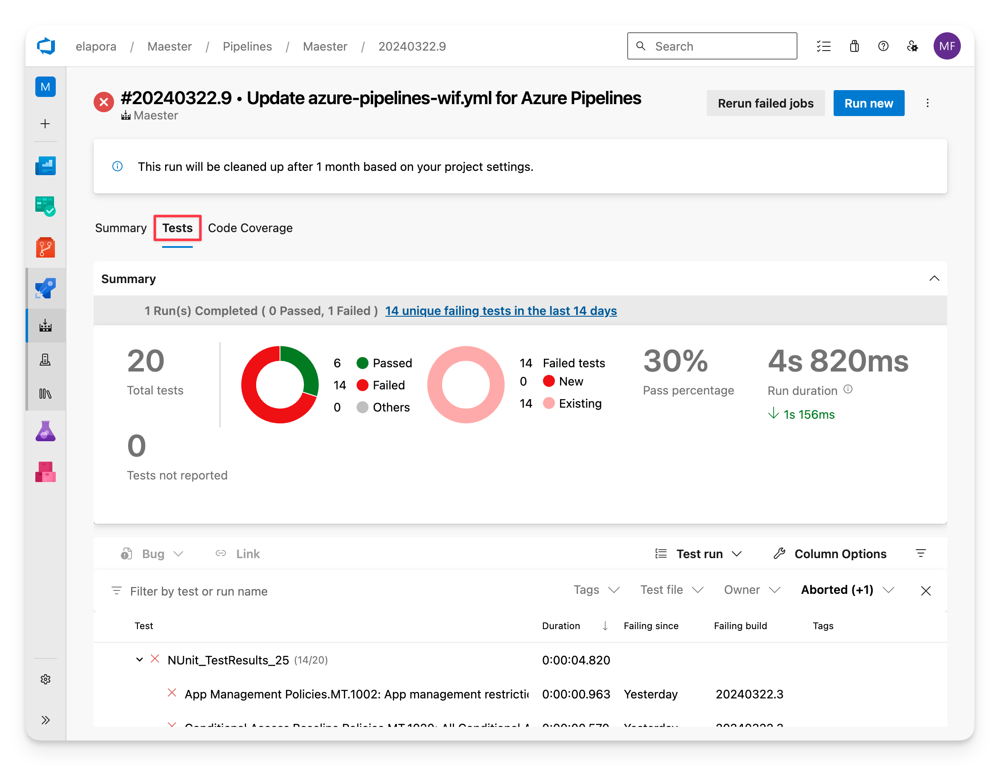

import Tabs from '@theme/Tabs';
import TabItem from '@theme/TabItem';
import GraphPermissions from '../sections/permissions.md';
import PrivilegedPermissions from '../sections/privilegedPermissions.md';
import CreateEntraApp from '../sections/create-entra-app.md';
import CreateEntraClientSecret from '../sections/create-entra-client-secret.md';

# <IIcon icon="vscode-icons:file-type-azurepipelines" height="48" /> Set up Maester in Azure DevOps

This guide will walk you through setting up Maester in Azure DevOps and automate the running of tests using Azure DevOps Pipelines.

## Why Azure DevOps?

Azure DevOps is a great way to automate the daily running of Maester tests to monitor your tenant. You can use Azure DevOps to run Maester tests on a schedule, such as daily, and view the results in the Azure DevOps interface.

Azure DevOps comes with a [free tier](https://azure.microsoft.com/pricing/details/devops/azure-devops-services/) that includes 1,800 minutes of Maester test runs per month (unlimited hours if you use a self-hosted agent).

Azure DevOps has native integration with Microsoft Entra including single sign on, user and group management as well as support for conditional access policies.

## Set up the Maester repository in Azure DevOps

### Pre-requisites

- If this is your first time using Azure DevOps, you will first need to create an organization.
  - [Azure DevOps - Create an organization](https://learn.microsoft.com/azure/devops/organizations/accounts/create-organization)
    :::tip
    To enable the free tier, to use a Microsoft-hosted agent, for Azure Pipelines you will need to submit this form https://aka.ms/azpipelines-parallelism-request (it can take a few days before you can use the pipeline.) In the interim you can use a [self-hosted agent](https://learn.microsoft.com/azure/devops/pipelines/agents/agents?view=azure-devops&tabs=yaml%2Cbrowser#self-hosted-agents) to get started.
    :::
- Create a new project to host your Maester tests and Azure Pipeline.
  - [Azure DevOps - Create a project](https://learn.microsoft.com/azure/devops/organizations/projects/create-project)

### Import the Maester Tests repository

- Select **Repos** from the left-hand menu
- Select the **Import** button in the **Import a repository** section
- Enter the URL of the Maester repository `https://github.com/maester365/maester-tests`
- Select **Import** to import the repository into your Azure DevOps project.

## Set up the Azure Pipeline

There are many ways to authenticate with Microsoft Entra in Azure DevOps. We recommend using [**workload identity federation**](https://learn.microsoft.com/entra/workload-id/workload-identity-federation) as it is more secure, requires less maintenance and is the easiest to set up.

If you’re unable to use more advanced options like certificates stored in Azure Key Vault, which need an Azure subscription, there’s also guidance available for using client secrets.

- <IIcon icon="gravity-ui:nut-hex" height="18" /> **Workload identity federation** (recommended) uses OpenID Connect (OIDC) to authenticate with Microsoft Entra protected resources without using secrets.
- <IIcon icon="material-symbols:password" height="18" /> **Client secret** uses a secret to authenticate with Microsoft Entra protected resources.

<Tabs>
  <TabItem value="wif" label="Workload identity federation (recommended)" default>

### Pre-requisites

- An Azure subscription is required for this method.
  - If you don't have an Azure subscription, you can create one by following [Create a Microsoft Customer Agreement subscription](https://learn.microsoft.com/azure/cost-management-billing/manage/create-subscription) or ask your Azure administrator to create one.

### Create an empty Azure Resource Group

This empty resource group is required to set up workload identity federation authentication. No Azure resources will be created in this resource group and there are no costs associated with it.

- Browse to the Azure portal and open the **[Resource groups](https://portal.azure.com/#blade/HubsExtension/BrowseResourceGroups)** blade.
- Select **+ Create**.
- Enter a name for the resource group (e.g. `Maester-Resource-Group`)
- Select any region
- Select **Review + create** > **Create**

### Create a new workload identity federation service connection

- In the Azure DevOps project, go to **Project settings** > **Service connections**.
- Select **New service connection**, and then select **Azure Resource Manager**.
- Select **Workload identity federation (automatic)**.
- Specify the following parameters:
  - **Subscription**: Select an existing Azure subscription.
  - **Resource Group**: Select the resource group created in the previous step. (e.g. `Maester Resource Group`) Leaving this field empty will grant Contribute access to all resources in the subscription.
  - **Service connection name**: A name for this connection (e.g. `Maester Service Connection`)
- Select **Save** to create the connection.

### Grant permissions to Microsoft Graph

- Select the service connection you created in the previous step (e.g. `Maester Service Connection`)
  - Service connections are listed under **Project settings** > **Service connections**.
- Select **Manage Service Principal** to open the Service Principal in the Entra portal.
- Select **API permissions** > **Add a permission**
- Select **Microsoft Graph** > **Application permissions**
- Search for each of the permissions and check the box next to each permission:
  <GraphPermissions/>
- Optionally, search for each of the permissions if you want to allow privileged permissions:
  <PrivilegedPermissions/>
- Select **Add permissions**
- Select **Grant admin consent for [your organization]**
- Select **Yes** to confirm

### Create Azure Pipeline

- Open your Azure DevOps project
- Select **Pipelines** > **New pipeline**
- Select **Azure Repos Git** as the location of your code
- Select the repository where you imported the Maester tests
- Select **Starter pipeline**
- Replace the content of the `azure-pipelines.yml` file with the code below
- Verify the `azureSubscription` value is set to the service connection you created in the previous step (e.g. `Maester Service Connection`)
- Select **Validate and save** > **Save**
- Select **Run** to run the pipeline
- Select **Job** to view the test results

<Tabs>
  <TabItem value="agent-MS" label="Microsoft-hosted agent" default>

```yaml
# Maester Daily Tests

trigger:
  - main

schedules:
  - cron: "0 0 * * *"
    displayName: Daily midnight build
    branches:
      include:
        - main

pool:
  vmImage: ubuntu-latest

steps:
  - task: AzurePowerShell@5
    displayName: "Run Maester"
    inputs:
      azureSubscription: "Maester Service Connection"
      pwsh: true
      azurePowerShellVersion: LatestVersion
      ScriptType: InlineScript
      Inline: |
        # Connect to Microsoft Graph
        $accessToken = (Get-AzAccessToken -ResourceTypeName MSGraph).Token
        Connect-MgGraph $accessToken

        # Install Maester
        Install-Module Maester -Force

        # Configure test results
        $PesterConfiguration = New-PesterConfiguration
        $PesterConfiguration.TestResult.Enabled = $true
        $PesterConfiguration.TestResult.OutputPath = '$(System.DefaultWorkingDirectory)/test-results/test-results.xml'

        # Run Maester tests
        Invoke-Maester -Path $(System.DefaultWorkingDirectory)/tests/Maester/ -PesterConfiguration $PesterConfiguration -OutputFolder '$(System.DefaultWorkingDirectory)/test-results'
  - publish: $(System.DefaultWorkingDirectory)/test-results
    displayName: Publish Maester Html Report
    artifact: TestResults
  - task: PublishTestResults@2
    displayName: Publish Pester Test Results
    inputs:
      testResultsFormat: "NUnit"
      testResultsFiles: "**/test-results.xml"
      failTaskOnFailedTests: true
```

</TabItem>
<TabItem value="agent-vmss" label="Virtual Machine Scale Set (VMSS) hosted agent" default>

```yaml
# Maester Daily Tests

trigger:
  - main

schedules:
  - cron: "0 0 * * *"
    displayName: Daily midnight build
    branches:
      include:
        - main

pool:
  name: Maester-DevOps

jobs:
  - job: InstallPowerShell
    displayName: "Running Maester on VMSS"
    steps:
      - script: |
          # Update package list and install pre-requisites
          sudo apt-get update
          sudo apt-get install -y wget apt-transport-https software-properties-common

          # Import the public repository GPG keys
          wget -q https://packages.microsoft.com/config/ubuntu/20.04/packages-microsoft-prod.deb
          sudo dpkg -i packages-microsoft-prod.deb

          # Update the list of products
          sudo apt-get update

          # Enable the "universe" repositories
          sudo add-apt-repository universe

          # Install PowerShell
          sudo apt-get install -y powershell

          # Verify installation
          pwsh -v

          # Install Az and Microsoft Graph PowerShell
          sudo /usr/bin/pwsh -Command 'Find-Module -Name Az -RequiredVersion '12.0.0' -Repository 'PSGallery' | Save-Module -Path '/usr/share/az_12.0.0' -Force -Verbose'
          sudo /usr/bin/pwsh -Command 'Find-Module -Name Microsoft.Graph -RequiredVersion '2.19.0' -Repository 'PSGallery' | Save-Module -Path '/usr/share/microsoft.graph_2.19.0' -Force -Verbose'

        displayName: "Install PowerShell"
      - script: |
          echo "PowerShell installed successfully"
        displayName: "Verify Installation"
      - task: AzurePowerShell@5
        displayName: "Run Maester"
        inputs:
          azureSubscription: "Maester Service Connection"
          pwsh: true
          azurePowerShellVersion: OtherVersion
          preferredAzurePowerShellVersion: "12.0.0"
          ScriptType: InlineScript
          Inline: |
            # Load Modules
            import-module /usr/share/az_12.0.0/Az.Accounts
            import-module /usr/share/microsoft.graph_2.19.0/Microsoft.Graph.Authentication

            # Connect to Microsoft Graph
            $accessToken = (Get-AzAccessToken -ResourceTypeName MSGraph).Token
            Connect-MgGraph $accessToken

            # Install Maester
            Install-Module Maester -Force

            # Configure test results
            $PesterConfiguration = New-PesterConfiguration
            $PesterConfiguration.TestResult.Enabled = $true
            $PesterConfiguration.TestResult.OutputPath = '$(System.DefaultWorkingDirectory)/test-results/test-results.xml'

            # Run Maester tests
            Invoke-Maester -Path $(System.DefaultWorkingDirectory)/tests/Maester/ -PesterConfiguration $PesterConfiguration -OutputFolder '$(System.DefaultWorkingDirectory)/test-results'
      - publish: $(System.DefaultWorkingDirectory)/test-results
        displayName: Publish Maester Html Report
        artifact: TestResults
      - task: PublishTestResults@2
        displayName: Publish Pester Test Results
        inputs:
          testResultsFormat: "NUnit"
          testResultsFiles: "**/test-results.xml"
          failTaskOnFailedTests: true
```

</TabItem>
</Tabs>
  </TabItem>
  <TabItem value="cert" label="Client secret">

<CreateEntraApp/>

<CreateEntraClientSecret/>

### Create Azure Pipeline

- Open your Azure DevOps project
- Select **Pipelines** > **New pipeline**
- Select **Azure Repos Git** as the location of your code
- Select the repository where you imported the Maester tests
- Select **Starter pipeline**
- Select **Variable** to open the variables editor and add the following variables.
- In the Entra portal, open the application you created earlier and copy the following values from the **Overview** page:
  - Name: **TENANTID**, Value: The Directory (tenant) ID of the Entra tenant
  - Name: **CLIENTID**, Value: The Application (client) ID of the Entra application you created
  - Name: **CLIENTSECRET**, Value: The client secret you copied in the previous step
    - _Important: Tick the **Keep this value secret** checkbox_
- Replace the content of the `azure-pipelines.yml` file with the code below
- Select **Validate and save** > **Save**
- Select **Run** to run the pipeline
- Select **Job** to view the test results

<Tabs>
  <TabItem value="agent-MS-secret" label="Microsoft-hosted agent" default>

```yaml
# Maester Daily Tests

trigger:
  - main

schedules:
  - cron: "0 0 * * *"
    displayName: Daily midnight build
    branches:
      include:
        - main

pool:
  vmImage: ubuntu-latest

steps:
  - pwsh: |
      # Connect to Microsoft Graph
      $clientSecret = ConvertTo-SecureString -AsPlainText $env:PS_ClientSecret -Force
      [pscredential]$clientSecretCredential = New-Object System.Management.Automation.PSCredential($env:CLIENTID, $clientSecret)
      Connect-MgGraph -TenantId $env:TENANTID -ClientSecretCredential $clientSecretCredential

      # Install Maester
      Install-Module Maester -Force

      # Configure test results
      $PesterConfiguration = New-PesterConfiguration
      $PesterConfiguration.TestResult.Enabled = $true
      $PesterConfiguration.TestResult.OutputPath = '$(System.DefaultWorkingDirectory)/test-results/test-results.xml'

      # Run Maester tests
      Invoke-Maester -Path $(System.DefaultWorkingDirectory)/tests/Maester/ -PesterConfiguration $PesterConfiguration -OutputFolder '$(System.DefaultWorkingDirectory)/test-results'
    env:
      PS_ClientSecret: $(CLIENTSECRET)
    continueOnError: true
    displayName: Run Maester Tests
  - publish: $(System.DefaultWorkingDirectory)/test-results
    artifact: TestResults
    displayName: Publish Maester Html Report
  - task: PublishTestResults@2
    inputs:
      testResultsFormat: "NUnit"
      testResultsFiles: "**/test-results.xml"
    displayName: Publish Pester Test Results
```

</TabItem>
  <TabItem value="agent-VMSS-secret" label="Azure Virtual Machine Scale Set hosted agent" default>

```yaml
# Maester Daily Tests

trigger:
  - main

schedules:
  - cron: "0 0 * * *"
    displayName: Daily midnight build
    branches:
      include:
        - main

pool:
  name: Maester-DevOps

jobs:
  - job: InstallPowerShell
    displayName: "Running Maester on VMSS"
    steps:
      - script: |
          # Update package list and install pre-requisites
          sudo apt-get update
          sudo apt-get install -y wget apt-transport-https software-properties-common

          # Import the public repository GPG keys
          wget -q https://packages.microsoft.com/config/ubuntu/20.04/packages-microsoft-prod.deb
          sudo dpkg -i packages-microsoft-prod.deb

          # Update the list of products
          sudo apt-get update

          # Enable the "universe" repositories
          sudo add-apt-repository universe

          # Install PowerShell
          sudo apt-get install -y powershell

          # Verify installation
          pwsh -v

          # Install Az and Microsoft Graph PowerShell
          sudo /usr/bin/pwsh -Command 'Find-Module -Name Az -RequiredVersion '12.0.0' -Repository 'PSGallery' | Save-Module -Path '/usr/share/az_12.0.0' -Force -Verbose'
          sudo /usr/bin/pwsh -Command 'Find-Module -Name Microsoft.Graph -RequiredVersion '2.19.0' -Repository 'PSGallery' | Save-Module -Path '/usr/share/microsoft.graph_2.19.0' -Force -Verbose'

        displayName: "Install PowerShell"
      - script: |
          echo "PowerShell installed successfully"
        displayName: "Verify Installation"
      - task: AzurePowerShell@5
        displayName: "Run Maester"
        inputs:
          azureSubscription: "Maester Service Connection"
          pwsh: true
          azurePowerShellVersion: OtherVersion
          preferredAzurePowerShellVersion: "12.0.0"
          ScriptType: InlineScript
          Inline: |
            # Load Modules
            import-module /usr/share/az_12.0.0/Az.Accounts
            import-module /usr/share/microsoft.graph_2.19.0/Microsoft.Graph.Authentication

            # Connect to Microsoft Graph
            $accessToken = (Get-AzAccessToken -ResourceTypeName MSGraph).Token
            Connect-MgGraph $accessToken

            # Install Maester
            Install-Module Maester -Force

            # Configure test results
            $PesterConfiguration = New-PesterConfiguration
            $PesterConfiguration.TestResult.Enabled = $true
            $PesterConfiguration.TestResult.OutputPath = '$(System.DefaultWorkingDirectory)/test-results/test-results.xml'

            # Run Maester tests
            Invoke-Maester -Path $(System.DefaultWorkingDirectory)/tests/Maester/ -PesterConfiguration $PesterConfiguration -OutputFolder '$(System.DefaultWorkingDirectory)/test-results'
      - publish: $(System.DefaultWorkingDirectory)/test-results
        displayName: Publish Maester Html Report
        artifact: TestResults
      - task: PublishTestResults@2
        displayName: Publish Pester Test Results
        inputs:
          testResultsFormat: "NUnit"
          testResultsFiles: "**/test-results.xml"
          failTaskOnFailedTests: true
```

  </TabItem>
  </Tabs>
### Step-by-step video tutorial

<iframe width="686" height="386" src="https://www.youtube.com/embed/42FADXWrDBo" title="Maester Azure DevOps integration" frameborder="0" allow="accelerometer; autoplay; clipboard-write; encrypted-media; gyroscope; picture-in-picture; web-share" referrerpolicy="strict-origin-when-cross-origin" allowfullscreen></iframe>

  </TabItem>
  </Tabs>

## Viewing test results

- Select **Pipelines** > **Runs** to view the status of the pipeline
- Select on a run to view the test results

### Summary view

The summary view shows the status of the pipeline run, the duration, and the number of tests that passed, failed, and were skipped.


### Maester report

The Maester report can be downloaded and viewed by selecting the **Published** artifact.


### Tests view

The **Tests** tab shows a detailed view of each test, including the test name, duration, and status.



### Logs view

In the **Summary** tab select on any of the errors to view the raw logs from Maester.


## Keeping your Maester tests up to date

The Maester team will add new tests over time. To get the latest updates, use the commands below to update your Azure repository with the latest tests.

- Clone your fork of the **maester-tests** from Azure DevOps to your local machine. See [Clone an existing Git repo](https://learn.microsoft.com/azure/devops/repos/git/clone).
- Update the `Maester` PowerShell module to the latest version and load it.
- Change to the `maester-tests\tests` directory.
- Run `Update-MaesterTests`.

```powershell
cd maester-tests\tests

Update-Module Maester -Force
Import-Module Maester
Update-MaesterTests
```
