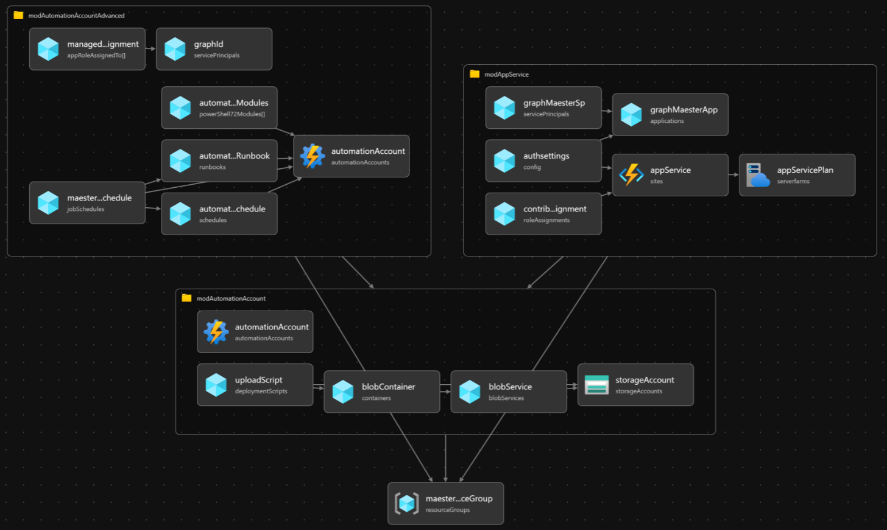
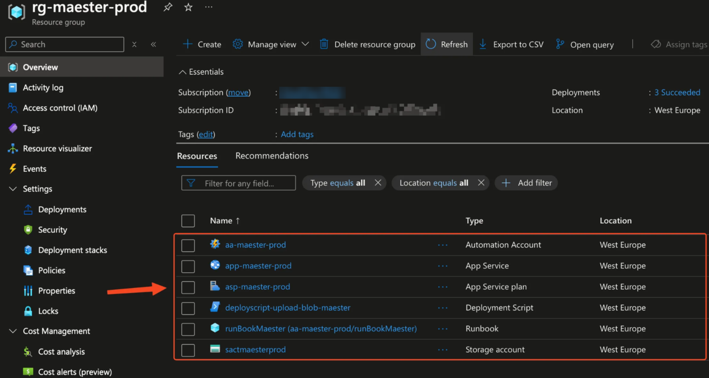
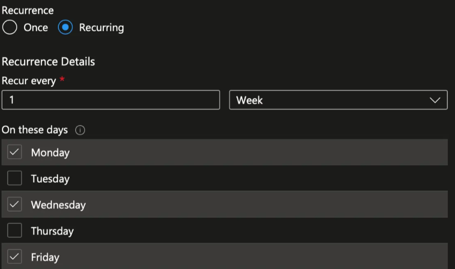

import GraphPermissions from '../sections/permissions.md';
import PrivilegedPermissions from '../sections/privilegedPermissions.md';

# <IIcon icon="devicon:azure" height="48" /> Setup Maester in Azure Web App using Azure Bicep

This guide will demonstrate how to get Maester running on an Azure Web App and provide an Azure Bicep template for automated deployment
-  This setup will allow you to perform security configuration checks on your Microsoft tenant by accessing the Azure Web App, which is protected with Entra ID Authentication through the Bicep deployment.🔥

## Why Azure Web App & Azure Automation & Azure Bicep?

Azure Web Apps provide the functionality to host your own websites. By running Maester in an interactive web app, you can easily check the security recommendations for your organization. Azure Automation generates a new Maester report every Monday, Wednesday, and Friday, which is then uploaded to the Azure Web App using Managed Identities.

 Azure Bicep is a domain-specific language that uses declarative syntax to deploy Azure resources. It simplifies the process of defining, deploying, and managing Azure resources. Here’s why Azure Bicep stands out:
- **Simplified Syntax**: Bicep provides concise syntax, reliable type safety, and support for reusing code.easier to read.
- **Support for all resource types and API versions**: Bicep immediately supports all preview and GA versions for Azure services.
- **Modular and Reusable**: Bicep enables the creation of modular templates that can be reused across various projects, ensuring consistency and minimizing duplication.



### Pre-requisites

- If this is your first time using Microsoft Azure, you must set up an [Azure Subscription](https://learn.microsoft.com/azure/cost-management-billing/manage/create-subscription) so you can create resources and are billed appropriately.
- You must have the **Global Administrator** role in your Entra tenant. This is so the necessary permissions can be consented to the Managed Identity.
- You must also have Azure Bicep & Azure CLI installed on your machine, this can be easily done with, using the following commands:

```PowerShell
winget install -e --id Microsoft.AzureCLI
winget install -e --id Microsoft.Bicep
```

## Template Walkthrough
This section will guide you through the templates required to deploy Maester on Azure Automation Accounts. Depending on your needs, this can be done locally or through CI/CD pipelines.
- For instance, using your favorite IDE such as VS Code.
- Alternatively, through Azure DevOps.

To be able to declare Microsoft Graph resources in a Bicep file, you need to enable the Bicep preview feature and specify the Microsoft Graph Bicep type versions, by configuring ```bicepconfig.json```

```json
{
    "experimentalFeaturesEnabled": {
        "extensibility": true
    },
    // specify an alias for the version of the v1.0 dynamic types package you want to use
    "extensions": {
      "microsoftGraphV1_0": "br:mcr.microsoft.com/bicep/extensions/microsoftgraph/v1.0:0.1.8-preview"
    }
}
```

The ```main.bicepparam``` template defines our input parameters, such as the environment, customer, location, and app roles for the Managed Identity (MI).

```bicep
using 'main.bicep'

// Defing our input parameters
param __env__ = 'prod'
param __cust__ = 'ct'
param __location__ = 'westeurope'
param __maesterAppRoles__ = [
  'Directory.Read.All'
  'DirectoryRecommendations.Read.All'
  'IdentityRiskEvent.Read.All'
  'Policy.Read.All'
  'Policy.Read.ConditionalAccess'
  'PrivilegedAccess.Read.AzureAD'
  'Reports.Read.All'
  'RoleEligibilitySchedule.Read.Directory'
  'RoleManagement.Read.All'
  'SharePointTenantSettings.Read.All'
  'UserAuthenticationMethod.Read.All'
]

param __maesterAutomationAccountModules__ = [
  {
    name: 'Maester'
    uri: 'https://www.powershellgallery.com/api/v2/package/Maester'
  }
  {
    name: 'Microsoft.Graph.Authentication'
    uri: 'https://www.powershellgallery.com/api/v2/package/Microsoft.Graph.Authentication'
  }
  {
    name: 'Pester'
    uri: 'https://www.powershellgallery.com/api/v2/package/Pester'
  }
  {
    name: 'NuGet'
    uri: 'https://www.powershellgallery.com/api/v2/package/NuGet'
  }
  {
    name: 'PackageManagement'
    uri: 'https://www.powershellgallery.com/api/v2/package/PackageManagement'
  }
]
```

The ```main.bicep``` template serves as the entry point for our Bicep configuration. It defines the parameters and variables used across the various modules.

```bicep
metadata name = 'Maester Automation as Code <3'
metadata description = 'Deploys Maester Automation Account with modules and runbook for automated reports on Mon, Wed, Fri via Azure Web App with Entra ID Auth'
metadata owner = 'Maester'
targetScope = 'subscription'

extension microsoftGraphV1_0

@description('Defing our input parameters')
param __env__ string
param __cust__ string
param __location__ string
param __maesterAppRoles__ array
param __maesterAutomationAccountModules__ array

@description('Defining our variables')
var _maesterResourceGroupName_ = 'rg-maester-${__env__}'
var _maesterAutomationAccountName_ = 'aa-maester-${__env__}'
var _maesterStorageAccountName_ = 'sa${__cust__}maester${__env__}'
var _maesterStorageBlobName_ = 'maester'
var _maesterStorageBlobFileName_ = 'maester.ps1'
var _appServiceName_ = 'app-maester-${__env__}'
var _appServicePlanName_ = 'asp-maester-${__env__}'
@description('Resource Group Deployment')
resource maesterResourceGroup 'Microsoft.Resources/resourceGroups@2023-07-01' = {
  name: _maesterResourceGroupName_
  location: __location__
}

@description('Module Deployment')
module modAutomationAccount './modules/aa.bicep' = {
  name: 'module-automation-account-deployment'
  params: {
    __location__: __location__
    _maesterAutomationAccountName_: _maesterAutomationAccountName_
    _maesterStorageAccountName_: _maesterStorageAccountName_
    _maesterStorageBlobName_: _maesterStorageBlobName_
    _maesterStorageBlobFileName_: _maesterStorageBlobFileName_
  }
  scope: maesterResourceGroup
}

module modAutomationAccountAdvanced './modules/aa-advanced.bicep' = {
  name: 'module-automation-account-advanced-deployment'
  params: {
    __location__: __location__
    __ouMaesterAutomationMiId__: modAutomationAccount.outputs.__ouMaesterAutomationMiId__
    __ouMaesterScriptBlobUri__: modAutomationAccount.outputs.__ouMaesterScriptBlobUri__
    _maesterAutomationAccountName_: _maesterAutomationAccountName_
    __maesterAppRoles__:  __maesterAppRoles__
    __maesterAutomationAccountModules__: __maesterAutomationAccountModules__

  }
  scope: maesterResourceGroup
}

module modAppService './modules/app-service.bicep' = {
  name: 'module-app-service-deployment'
  params: {
    __location__: __location__
    __ouMaesterAutomationMiId__: modAutomationAccount.outputs.__ouMaesterAutomationMiId__
    _appServiceName_: _appServiceName_
    _appServicePlanName_: _appServicePlanName_
  }
  scope: maesterResourceGroup
}
```

The ```aa.bicep``` module-file, automates the deployment of the Maester Azure Automation Account, a Storage Account, a container and uploads the Maester script to the Blob Container, which will be later used as input for our PowerShell runbook for the automation account to generate a security report.

```bicep

param __location__ string
param _maesterAutomationAccountName_ string
param _maesterStorageAccountName_ string
param _maesterStorageBlobName_ string
param _maesterStorageBlobFileName_ string

@description('Automation Account Deployment')
resource automationAccount 'Microsoft.Automation/automationAccounts@2023-11-01' = {
  name: _maesterAutomationAccountName_
  location: __location__
  identity: {
    type: 'SystemAssigned'
  }
  properties: {
    sku: {
      name: 'Basic'
    }
  }
}

resource storageAccount 'Microsoft.Storage/storageAccounts@2022-09-01' = {
  name: _maesterStorageAccountName_
  location: __location__
  sku: {
    name: 'Standard_LRS'
  }
  kind: 'StorageV2'
  properties: {
    accessTier: 'Hot'
    allowBlobPublicAccess: true
    networkAcls: {
      defaultAction: 'Allow'
    }
  }

}

@description('Create Blob Service')
resource blobService 'Microsoft.Storage/storageAccounts/blobServices@2022-09-01' = {
  parent: storageAccount
  name: 'default'
}

@description('Create Blob Container')
resource blobContainer 'Microsoft.Storage/storageAccounts/blobServices/containers@2022-09-01' = {
  parent: blobService
  name: _maesterStorageBlobName_
  properties: {
    publicAccess: 'Blob'
  }
}

@description('Upload .ps1 file to Blob Container using Deployment Script')
resource uploadScript 'Microsoft.Resources/deploymentScripts@2020-10-01' = {
  name: 'deployscript-upload-blob-maester'
  location: __location__
  kind: 'AzureCLI'
  properties: {
    azCliVersion: '2.26.1'
    timeout: 'PT5M'
    retentionInterval: 'PT1H'
    environmentVariables: [
      {
        name: 'AZURE_STORAGE_ACCOUNT'
        value: storageAccount.name
      }
      {
        name: 'AZURE_STORAGE_KEY'
        secureValue: storageAccount.listKeys().keys[0].value
      }
      {
        name: 'CONTENT'
        value: loadTextContent('../pwsh/maester.ps1')
      }
    ]
    // arguments: '-appName ${_appServiceName_} -rgName ${_maesterResourceGroupName}'
    scriptContent: 'echo "$CONTENT" > ${_maesterStorageBlobFileName_} && az storage blob upload -f ${_maesterStorageBlobFileName_} -c ${_maesterStorageBlobName_} -n ${_maesterStorageBlobFileName_}'
  }
  dependsOn: [
    blobContainer
  ]
}

@description('Outputs')
output __ouMaesterAutomationMiId__ string = automationAccount.identity.principalId
output __ouMaesterScriptBlobUri__ string = 'https://${_maesterStorageAccountName_}.blob.${environment().suffixes.storage}/${_maesterStorageBlobName_}/maester.ps1'
```

The ```aa-advanced.bicep``` module file automates the configuration of the Maester Azure Automation Account by setting up role assignments, installing necessary PowerShell modules, creating a runbook, defining a schedule, and associating the runbook with the schedule. This configuration enables Maester to run automatically in Azure according to the specified schedule. This module is separate due to the need for replicating the Managed Service Identity (MSI) in Entra ID. By dividing the configuration into two module files, we can add the API consents 💪🏻


```bicep
extension microsoftGraphV1_0
param __location__ string
param __maesterAppRoles__ array
param __maesterAutomationAccountModules__ array
param __ouMaesterAutomationMiId__ string
param __ouMaesterScriptBlobUri__ string
param _maesterAutomationAccountName_ string
param __currentUtcTime__ string = utcNow()

@description('Role Assignment Deployment')
resource graphId 'Microsoft.Graph/servicePrincipals@v1.0' existing = {
  appId: '00000003-0000-0000-c000-000000000000'
}

resource managedIdentityRoleAssignment 'Microsoft.Graph/appRoleAssignedTo@v1.0' = [for appRole in __maesterAppRoles__: {
    appRoleId: (filter(graphId.appRoles, role => role.value == appRole)[0]).id
    principalId: __ouMaesterAutomationMiId__
    resourceId: graphId.id
}]

@description('Existing Automation Account')
resource automationAccount 'Microsoft.Automation/automationAccounts@2023-11-01' existing = {
  name: _maesterAutomationAccountName_
}

@description('PowerShell Modules Deployment')
resource automationAccountModules 'Microsoft.Automation/automationAccounts/powerShell72Modules@2023-11-01' = [ for module in __maesterAutomationAccountModules__: {
  name: module.name
  parent: automationAccount
  properties: {
    contentLink: {
      uri: module.uri
    }
  }
}]

@description('Runbook Deployment')
resource automationAccountRunbook 'Microsoft.Automation/automationAccounts/runbooks@2023-11-01' = {
  name: 'runBookMaester'
  location: __location__
  parent: automationAccount
  properties: {
    runbookType: 'PowerShell72'
    logProgress: true
    logVerbose: true
    description: 'Runbook to execute Maester report'
    publishContentLink: {
      uri: __ouMaesterScriptBlobUri__
    }
  }
}

@description('Schedule Deployment')
resource automationAccountSchedule 'Microsoft.Automation/automationAccounts/schedules@2023-11-01' = {
  name: 'scheduleMaester'
  parent: automationAccount
  properties: {
    advancedSchedule: {
      weekDays:[
        'Monday'
        'Wednesday'
        'Friday'
      ]
    }
    expiryTime: '9999-12-31T23:59:59.9999999+00:00'
    frequency: 'Week'
    interval: 1
    startTime: dateTimeAdd(__currentUtcTime__, 'PT1H')
    timeZone: 'W. Europe Standard Time'
  }
}

@description('Runbook Schedule Association')
resource maesterRunbookSchedule 'Microsoft.Automation/automationAccounts/jobSchedules@2023-11-01' = {
  name: guid(automationAccount.id, 'runb', 'sched')
  parent: automationAccount
  properties: {
    parameters: {}
    runbook: {
      name: automationAccountRunbook.name
    }
    schedule: {
      name: automationAccountSchedule.name
    }
  }
}
```

The ```app-service.bicep``` module-file automates deployment of an Azure App Service with an associated App Service Plan and configures Entra ID authentication. It ensures that the App Service can authenticate users via Entra ID and access Microsoft Graph API with the ```User.Read``` permissions.

```bicep
param __location__ string
param _appServiceName_ string
param _appServicePlanName_ string
param __ouMaesterAutomationMiId__ string
extension microsoftGraphV1_0

@description('Role Assignments Deployment')
resource contributorRoleAssignment 'Microsoft.Authorization/roleAssignments@2022-04-01' = {
  scope: appService
  name: guid(appService.id)
  properties: {
    roleDefinitionId: subscriptionResourceId('Microsoft.Authorization/roleDefinitions', 'b24988ac-6180-42a0-ab88-20f7382dd24c') // Contributor role ID
    principalId: __ouMaesterAutomationMiId__
  }
}

resource appServicePlan 'Microsoft.Web/serverfarms@2021-02-01' = {
  name: _appServicePlanName_
  location: __location__
  sku: {
    name: 'B1'
    tier: 'Basic'
  }
}

resource graphMaesterApp 'Microsoft.Graph/applications@v1.0' = {
  uniqueName: 'app-maester-prod'
  signInAudience: 'AzureADMyOrg'
  displayName: 'app-maester-prod'
  web: {
    redirectUris: [
      'https://${_appServiceName_}.azurewebsites.net/.auth/login/aad/callback'
    ]
    implicitGrantSettings: {
      enableIdTokenIssuance: true
      enableAccessTokenIssuance: false
    }
  }
  requiredResourceAccess: [
    {
      resourceAppId: '00000003-0000-0000-c000-000000000000' // Microsoft Graph
      resourceAccess: [
        {
          id: 'e1fe6dd8-ba31-4d61-89e7-88639da4683d' // User.Read
          type: 'Scope'
        }
      ]
    }
  ]
}

resource graphMaesterSp 'Microsoft.Graph/servicePrincipals@v1.0' = {
  appId: graphMaesterApp.appId
}

resource appService 'Microsoft.Web/sites@2024-04-01' = {
  name: _appServiceName_
  location: __location__
  identity: {
    type: 'SystemAssigned'
  }
  properties: {
    serverFarmId: appServicePlan.id
    siteConfig: {
      appSettings: [
        {
          name: 'WEBSITE_RUN_FROM_PACKAGE'
          value: '1'
        }
      ]
    }
  }
}

resource authsettings 'Microsoft.Web/sites/config@2022-09-01' = {
 parent: appService
 name: 'authsettingsV2'
  properties: {
    globalValidation: {
      redirectToProvider: 'Microsoft'
      requireAuthentication: true
      unauthenticatedClientAction: 'RedirectToLoginPage'
    }
    identityProviders: {
      azureActiveDirectory: {
        enabled: true
        registration: {
          clientId: graphMaesterApp.appId
          openIdIssuer: 'https://sts.windows.net/${subscription().tenantId}/v2.0'
          clientSecretSettingName: 'MICROSOFT_PROVIDER_AUTHENTICATION_SECRET'
        }
        validation: {
          jwtClaimChecks: {}
          allowedAudiences: [
            'api://${graphMaesterApp.appId}'
          ]
        }
      }
    }
  }
}
```

The PowerShell script has been updated to generate an HTML report, which is then zipped. This package is uploaded to the Azure Web App and published using the Managed Identity of the Automation Account, which has RBAC assignment on the Azure Web App.
```PowerShell
$appName = "app-maester-prod"
$resourceGroupName = "rg-maester-prod"

#Connect to Microsoft Graph with Mi
Connect-MgGraph -Identity

#create output folder
$date = (Get-Date).ToString("yyyyMMdd-HHmm")
$FileName = "MaesterReport" + $date + ".zip"

$TempOutputFolder = $env:TEMP + $date
if (!(Test-Path $TempOutputFolder -PathType Container)) {
    New-Item -ItemType Directory -Force -Path $TempOutputFolder
}

#Run Maester report
cd $env:TEMP
md maester-tests
cd maester-tests
Install-MaesterTests .\tests

#Invoke Maester for HTML page
Invoke-Maester -OutputHtmlFile "$TempOutputFolder\index.html"

# Create the zip file
Compress-Archive -Path "$TempOutputFolder\*" -DestinationPath $FileName

# Connect Az Account using MI
Connect-AzAccount -Identity

#Publish to Azure Web App <3
Publish-AzWebApp -ResourceGroupName $resourceGroupName -Name $appName -ArchivePath $FileName -Force
```


## Deployment

- You have the flexibility to deploy either based on deployment stacks or directly to the Azure Subscription.
- Using Deployment Stacks allows you to bundle solutions into a single package, offering several advantages
  - Management of resources across different scopes as a single unit
  - Securing resources with deny settings to prevent configuration drift
  - Easy cleanup of development environments by deleting the entire stack


Directly deployed based:
```PowerShell
#Connect to Azure
Connect-AzAccount

#Getting current context to confirm we deploy towards right Azure Subscription
Get-AzContext

# If not correct context, change, using:
# Get-AzSubscription
# Set-AzContext -SubscriptionID "ID"

#Deploy to Azure Subscription
New-AzSubscriptionDeployment -Name Maester -Location WestEurope -TemplateFile .\main.bicep -TemplateParameterFile .\main.bicepparam
```

Deployment Stack based:
```PowerShell
#Connect to Azure
Connect-AzAccount

#Getting current context to confirm we deploy towards right Azure Subscription
Get-AzContext

# If not correct context, change, using:
# Get-AzSubscription
# Set-AzContext -SubscriptionID "ID"

#Change DenySettingsMode and ActionOnUnmanage based on your needs..
New-AzSubscriptionDeploymentStack -Name Maester -Location WestEurope -DenySettingsMode None -ActionOnUnmanage DetachAll -TemplateFile .\main.bicep -TemplateParameterFile .\main.bicepparam
```

## Viewing the Azure Resources
We can see the resources located in the resource group called ```rg-maester-prod```.



The schedule of the Automation Account which will trigger on Monday, Wednesday, and Friday to upload new Maester report to the Azure Web App. You can easily adjust the schedule to suit your needs:


## Viewing the Azure Web App


## FAQ / Troubleshooting

- Ensure you have the latest version of Azure Bicep, as the ```microsoftGraphV1_0``` module depends on the newer versions

## Contributors

- Original author: [Brian Veldman](https://www.linkedin.com/in/brian-veldman/) | Technology Enthusiast
