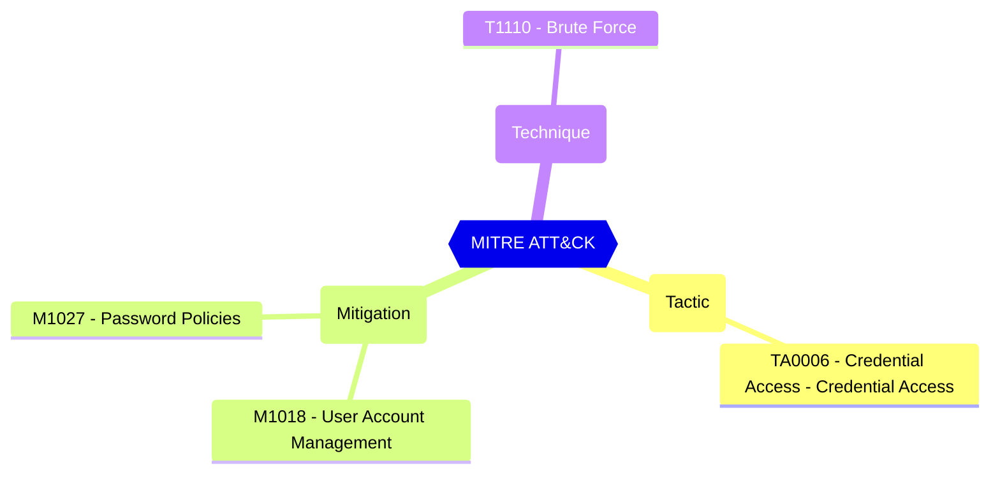

# Default Settings - Password Rule Settings - Smart Lockout - Lockout duration in seconds

The minimum length in seconds of each lockout. If an account locks repeatedly, this duration increases.

| | |
|-|-|
| **Name** | LockoutDurationInSeconds |
| **Control** | Default Settings - Password Rule Settings |
| **Description** | Define the password protection and Smart Lockout configurations that can be used to customize the tenant-wide and object-specific restrictions and allowed behavior |
| **Severity** | High |

## How to fix

### Details of configuration item
| | |
|-|-|
| **Recommendation** | [Prevent attacks using smart lockout - Microsoft Entra ID - Microsoft Learn](https://learn.microsoft.com/en-us/azure/active-directory/authentication/howto-password-smart-lockout) |
| **Configuration** | settings |
| **Setting** | `values | where-object name -eq 'LockoutDurationInSeconds' | select-object -expand value` |
| **Recommended Value** | is greater than or equal to '60' |
| **Default Value** | 60 |
| **Graph API Docs** | [directorySetting resource type - Microsoft Graph beta - Microsoft Learn](https://learn.microsoft.com/en-us/graph/api/resources/directorysetting) |
| **Graph Explorer** | [Open in Graph Explorer](https://developer.microsoft.com/en-us/graph/graph-explorer?request=settings&method=GET&version=beta&GraphUrl=https://graph.microsoft.com) |

## MITRE ATT&CK

|Tactic|Technique|Mitigation|
|---|---|---|
|[TA0006 - Credential Access - Credential Access](https://attack.mitre.org/tactics/TA0006)|[T1110 - Brute Force](https://attack.mitre.org/techniques/T1110)|[M1018 - User Account Management](https://attack.mitre.org/mitigations/M1018) [M1027 - Password Policies](https://attack.mitre.org/mitigations/M1027)|

