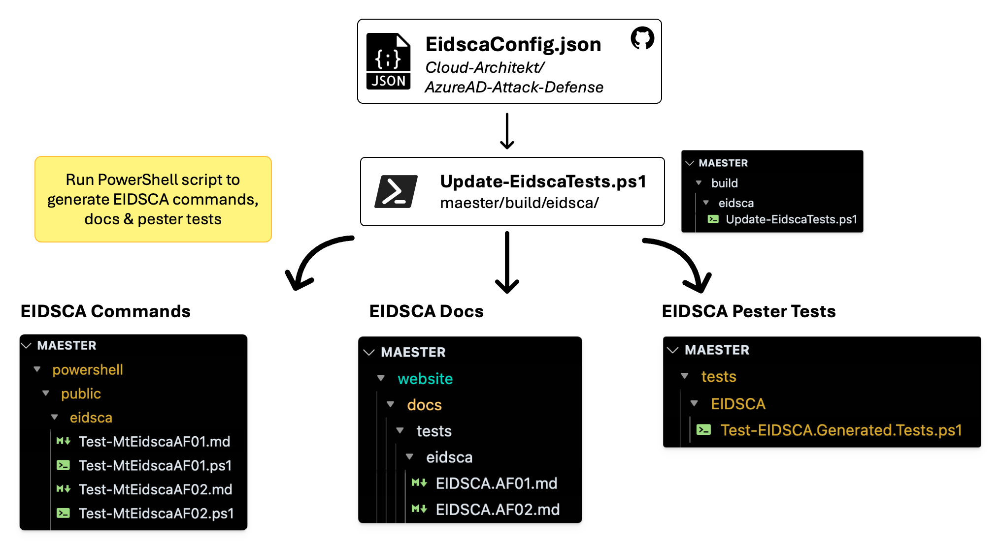

import TOCInline from '@theme/TOCInline';

# Contributing

<TOCInline toc={toc} />

## Introduction

This guide is for anyone who wants to contribute to the Maester project. Whether you want to contribute to the code, documentation, or just have an idea for a new feature, we welcome your input.

Follow the guide below to set up Maester for development on your local machine, make changes, and submit a pull request.

## Maester PowerShell module dev guide

### Simple debugging

- Set a breakpoint anywhere in the code and hit F5
- The launch.json has been configured to re-load the module

### Manual editing

- Load the PowerShell module. This needs to be done anytime you make changes to the code in `./powershell`.
  - `Import-Module ./powershell/Maester.psd1 -Force`
- Run Maester
  - `Invoke-Maester`

### Pester Tests

- Tests for the Maester module are at /powershell/tests
- When making changes to the module you can run the test locally by running `/powershell/tests/pester.ps1`
- The **PSScriptAnalyzer**, **PSFramework** and **PSModuleDevelopment** modules are required to run the tests, install them with `Install-Module PSFramework, PSModuleDevelopment, PSScriptAnalyzer`
- The tests are run automatically on PRs and commits to the main branch and will fail if the tests do not pass

## Contributing new tests and updating existing tests

### Test folder convention

We have the following [test](https://github.com/maester365/maester/tree/main/tests) folders:

- `/CISA` - CISA tests
- `/Custom` - Folder for user's to add tests (do not add any tests to this folder).
- `/EIDSCA` - EIDSCA tests
- `/Maester` - Maester tests
  - `/Entra` - Maester's Entra tests

### Checklist for writing good tests

When contributing tests, please ensure the following:

#### Before writing the test

- [x] Check if your new idea is not already covered by an existing test (you can also jump on the [Maester Discord](https://discord.entra.news) to discuss)
- [x] Reserve a unique id for your test (e.g. `Invoke-Maester -Tag MS.AAD.5.1`). See [#️⃣ Pick next Maester test sequence number](https://github.com/maester365/maester/issues/697) on how to reserve a unique id for your new test.
- [x] Decide if the test should go into an existing .Tests.ps1

#### Writing the test
- [x] Decide in which folder the test should live. See **Test folder convention** above.
- [x] Decide if you are going to add the test to an existing .Tests.ps1 file or create a new one. E.g. If it's CA related you can add to the existing CA tests file. Don't stress over this, it's easy to move it around at any time.
- [x] Follow the guide at [Writing custom tests - Advanced Guide](/docs/writing-tests/advanced-concepts) to write your test.
- [x] The code inside the cmdlet is wrapped inside a try..catch (see advanced guide above).
- [x] Add the `FunctionsToExport` cmdlet to the .psd1 file
- [x] The related cmdlet for the test has a .md file to explain the test in detail and provides all the context required for the user to resolve the issue, including deep links to the admin portal page to resolve the issue. This will be shown to the user when they view the test report. The file should include:
  - [x] Link to the admin portal blade where the setting can be configured
  - [x] If there are multiple objects (e.g. list of CA policies, Users, etc) then use the `GraphObjects` and `GraphObjectType` parameters in [Add-MtTestResultDetail](https://github.com/maester365/maester/blob/main/powershell/public/Add-MtTestResultDetail.ps1). These include deep links to the admin portal. If the object type you wish is not available you can add it to [Get-GraphObjectMarkdown.ps1](https://github.com/maester365/maester/blob/main/powershell/internal/Get-GraphObjectMarkdown.ps1). Feel free to ask on Discord if you need help with this.
  - [x] If the test is about a specific setting the message should link to the page where the setting can be configured. The .md file should also include steps to configure the setting as well as a link to the admin portal. For a good example of a well written error page see [Test-MtCisaWeakFactor.ps1](https://github.com/maester365/maester/blob/main/powershell/public/cisa/entra/Test-MtCisaWeakFactor.ps1). Another good example is [Test-MtCisaAppUserConsent.ps1](https://github.com/maester365/maester/blob/main/powershell/public/cisa/entra/Test-MtCisaAppUserConsent.ps1) and the related [Test-MtCisaAppAdminConsent.md](https://github.com/maester365/maester/blob/main/powershell/public/cisa/entra/Test-MtCisaAppAdminConsent.md).

When in doubt always check the existing tests for the conventions used, feel free to discuss on [Discord](https://discord.entra.news) or [GitHub Issues](https://github.com/maester365/maester/issues).

#### Before creating the Pull Request

##### Test your code

- We run a bunch of pester tests on your code when a PR is raised and will block merge until the issues are addressed.
- Before you submit the PR, run the tests locally by running `/powershell/tests/pester.ps1`
- Fix any issues that are reported. If you need help see the `Common Pester test failures and how to fix` section below. Reach out on Discord if you need help.
- The **PSScriptAnalyzer**, **PSFramework** and **PSModuleDevelopment** modules are required to run the tests, install them with `Install-Module PSFramework, PSModuleDevelopment, PSScriptAnalyzer`
- If a test is not applicable (e.g. it says not to use plural but the product name is AzureDevOps then you can add a `SuppressMessageAttribute` tag (see Invoke-Maester.ps1 which has supression tags at the beginning of the function).

### Updating EIDSCA tests and documentation

The EIDSCA tests and documentation are maintained in the [EIDSCA repository → EidscaConfig.json](https://github.com/Cloud-Architekt/AzureAD-Attack-Defense/blob/AADSCAv4/config/EidscaConfig.json) file.

The [/build/eidsca/Update-EidscaTests.ps1](https://github.com/maester365/maester/blob/main/build/eidsca/Update-EidscaTests.ps1) script is used to generate the EIDSCA commands in the Maester module along with the EIDSCA tests and documentation.

The script is currently run manually and is not automated as part of the build process as we need to verify the changes before they are committed.

The illustration below shows the workflow for integrating EIDSCA tests and documentation into Maester.



When generating the EIDSCA commands and tests, manual verification should be performed to ensure the EIDSCA tests are being run correctly and the results are accurate.

## Common Pester test failures and how to fix

### PSUseBOMForUnicodeEncodedFile

The quick fix for this is to run this script. Make sure you give the right path to the affected file.

```powershell
$affectedFilePath = '/Users/merill/GitHub/maester/powershell/public/maester/entra/Test-MtTenantCreationRestricted.ps1'
$content = Get-Content $affectedFilePath -Raw; $content | Out-File $affectedFilePath -Encoding UTF8BOM
```

## Contributing to Maester docs and blog posts

Simple edits can be made in the GitHub UI by selecting the `Edit this page` link at the bottom of each page or you can browse to the [docs](https://github.com/maester365/maester/tree/main/website/docs) folder on GitHub.

For more complex changes, you can fork the repository and submit a pull request.

The docs/commands folder is auto-generated based on the comments in the PowerShell cmdlets. If you want to update the documentation for a command, you will need to update the comment-based help in the .ps1 file for the command.

### Running documentation locally

The [Maester.dev](https://maester.dev) website is built using [Docusaurus](https://docusaurus.io/).

Follow this guide if you want to run the documentation locally and view changes in real-time.

#### Pre-requisites

[Node.js](https://nodejs.org/en/download/) version 18.0 or above (which can be checked by running node -v). When installing Node.js, you are recommended to check all checkboxes related to dependencies.

#### Installation

When running the documentation for the first time, you will need to install the dependencies. This can be done by running the following command in ./website folder.

```
npm install
```

#### Starting the site

While in the ./website folder run the following command to start the site locally. This will start a local server and open the site in your default browser to http://localhost:3000/

```
npm start
```

#### Editing content

You will now be able to edit add and edit markdown files in the ./website/docs folder and see the changes in real-time in your browser.

- Read the [markdown documentation](https://docusaurus.io/docs/markdown-features) for more information on some of the custom markdown features available.
- You can search for icons at [Iconify](https://icon-sets.iconify.design/) and include them in the markdown. See the [Daily Automation](https://maester.dev/docs/automation/) page for examples.
- The `Command Reference` section is auto-generated. To update the documentation for this, the .ps1 file for the command needs to be updated with comment-based documentation.

### Site versioning

There are two versions of the Maester website:

- [Production](https://maester.dev) - This is the live version of the site that is updated whenever a new version of the Maester module is released.
- [Preview](https://preview.maester.dev) - This is the version of the site that is updated with every commit to the main branch. This allows you to see changes before they are published to production.

| Environment | URL                          | Branch       |  Update Trigger                    |
|-------------|------------------------------|--------------| -----------------------------------|
| Production  | https://maester.dev          | website-prod | New Maester module release         |
| Preview     | https://preview.maester.dev  | main         | Every commit to the main branch    |

When a new version of the Maester module is released, the documentation will be updated to reflect the changes in that version.

#### Urgent changes to blog posts and documentation

If a blog post or doc change is urgent and cannot wait till the next release, create a PR against the `website-prod` branch directly.

Once that is reviewed and merged, you will need to create another PR to bring the changes into the `main` branch.

This is because the `website-prod` branch is deleted and recreated with every Maester module release to ensure it is always in sync with the released version of the module.

This process ensures any interim changes to the production site are intentional.
