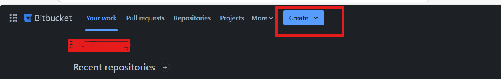
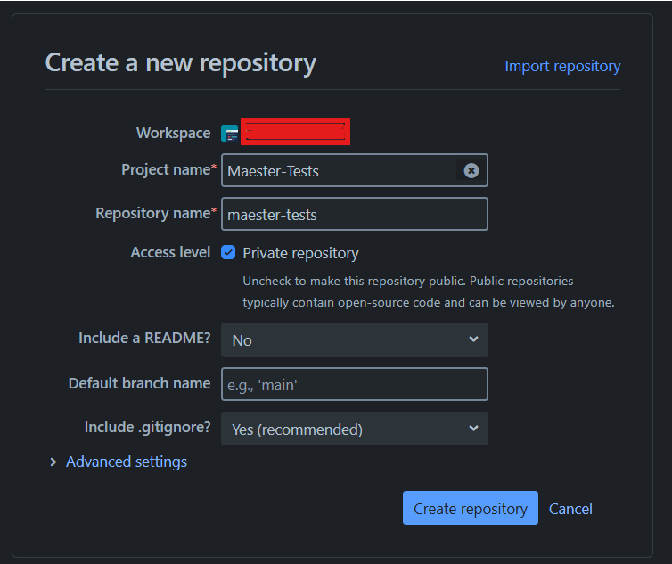
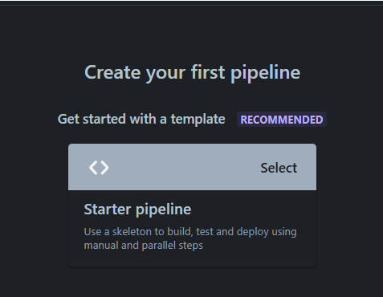
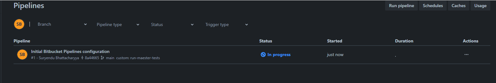
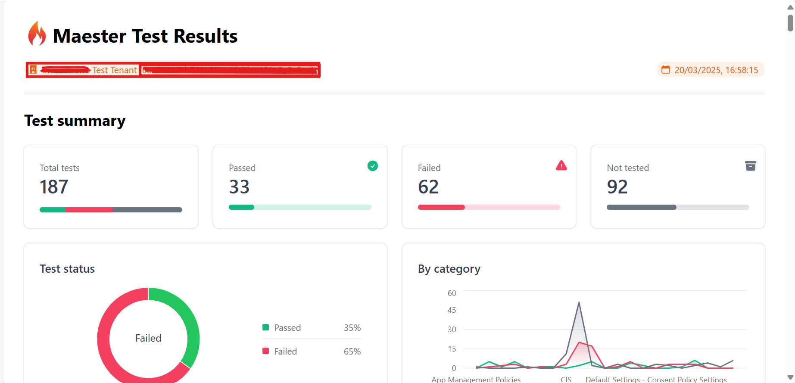

import Tabs from '@theme/Tabs';
import TabItem from '@theme/TabItem';
import GraphPermissions from '../sections/permissions.md';
import CreateEntraApp from '../sections/create-entra-app.md';
import CreateEntraClientSecret from '../sections/create-entra-client-secret.md';

# <IIcon icon="mdi:BitBucket" height="48" /> Set up Maester in BitBucket

This guide will walk you through setting up Maester in BitBucket and automate the running of tests using BitBucket Pipelines.

## Set up your Maester tests repository in BitBucket

### Pre-requisites

- If you are new to BitBucket, create an account at [BitBucket.com](https://www.atlassian.com/try/cloud/signup?bundle=bitbucket) for organizations
- If you use BitBucket.com, you can run your CI/CD pipelines workflows on [BitBucket-hosted runners](https://www.atlassian.com/software/bitbucket/features/pipelines).

### Create a blank new project to always use the latest available public Maester Tests

- On the top bar, at the top, select 'Create ' and select 'Repository' from the dropdown.



- Create a New Repository [Create a repository](https://support.atlassian.com/bitbucket-cloud/docs/create-a-repository/)

  - Project: Choose an existing project or create a new one.
  - Repository name: Give your repository a descriptive name (e.g., maester-tests).
  - Select the checkbox Access Level: Private Repository
    

- Once the repository is created, navigate to the **Repository settings** --> **Settings** in left navigation bar. From **Settings** toggle **Enable Pipelines.**
    
- Click on the **Configure bitbucket-pipelines.yml.** and Click on the **Starter Pipeline** to create a pipeline. This will add the `bitbuckets-pipelines.yml` file for **Bitbucket CI/CD Pipeline**. We need to edit the initial code for running public Maester tests.
    
    

There are many ways to authenticate with Microsoft Entra. We currently have tested client secrets, but there are probably more options available.

- <IIcon icon="material-symbols:password" height="18" /> **Client secret** uses a secret to authenticate with Microsoft Entra protected resources.

<Tabs>
<!--
<TabItem value="wif" label="Custom workflow using Workload identity federation" >
    ToBeTested ...
</TabItem>
-->
<TabItem value="cert" label="Custom workflow using client secret" default>

<CreateEntraApp/>

<CreateEntraClientSecret/>

### Create Bitbucket repository variables

- Open your `maester-tests` Open your maester-tests Bitbucket repository and go to Repository settings.
- Select **Pipelines** > **Repository variables**.
- Add the three secrets listed below. Make sure to check the checkbox (`[x]`) for each variable.
    
- To look up these values you will need to use the Entra portal, open the application you created earlier and copy the following values from the **Overview** page:
  - Visibility: Visible, Key: **AZURE_TENANT_ID**, Value: The Directory (tenant) ID of the Entra tenant
  - Visibility: Visible, Key: **AZURE_CLIENT_ID**, Value: The Application (client) ID of the Entra application you created
  - Visibility: Masked and hidden, Key: **AZURE_CLIENT_SECRET**, Value: The client secret you copied in the previous step
- Save each secret by selecting **Add variable** at the bottom.

## Edit bitbucket-pipelines.yml file (using the pipeline editor or IDE)

```yaml
# Global options
options:
  max-time: 120 # 2 hours max runtime for all pipelines

# Git clone behavior
clone:
  depth: 1 # Shallow clone for faster checkout

# Cache and service container definitions
definitions:
  caches:
    powershell: ~/.powershell

# Docker image options (global)
image: mcr.microsoft.com/microsoftgraph/powershell:latest

# Pipeline configuration
pipelines:
  custom:
    run-maester-tests:
      - stage:
          name: Maester Testing Stage
          # Step configuration
          steps:
            - step:
                name: Run Maester Tests
                size: 2x # Standard size
                caches:
                  - powershell
                script:
                  - mkdir test-results
                  - mkdir public-tests
                  - pwsh -c 'Write-host "Running in project $BITBUCKET_REPO_SLUG with results at $BITBUCKET_BUILD_NUMBER."'
                  - |
                    pwsh -Command '
                      # Connect to Microsoft Graph - Access environment variables correctly
                      $clientSecret = ConvertTo-SecureString -AsPlainText "$env:AZURE_CLIENT_SECRET" -Force
                      [pscredential] $clientSecretCredential = New-Object System.Management.Automation.PSCredential("$env:AZURE_CLIENT_ID", $clientSecret)
                      Connect-MgGraph -TenantId "$env:AZURE_TENANT_ID" -ClientSecretCredential $clientSecretCredential -NoWelcome

                      # Install Maester
                      Install-Module Maester -Force

                      # Latest public tests
                      cd public-tests
                      Install-MaesterTests
                      cd ..

                      # Configure test results
                      $PesterConfiguration = New-PesterConfiguration
                      $PesterConfiguration.Output.Verbosity = "None"
                      Write-Host "Pester verbosity level set to: $($PesterConfiguration.Output.Verbosity.Value)"

                      $MaesterParameters = @{
                        Path                 = "public-tests"
                        PesterConfiguration  = $PesterConfiguration
                        OutputFolder         = "test-results"
                        OutputFolderFileName = "test-results"
                        PassThru             = $true
                        NonInteractive       = $true
                      }

                      # Add DisableTelemetry parameter
                      $MaesterParameters.Add("DisableTelemetry", $true)
                      Write-Host "Pester telemetry set to: $($MaesterParameters.DisableTelemetry)"

                      # Run Maester tests
                      $results = Invoke-Maester @MaesterParameters

                      # View summary report
                      $results | Format-List Result, FailedCount, PassedCount, SkippedCount, TotalCount, TenantId, TenantName, CurrentVersion, LatestVersion

                      # Flag status to Bitbucket
                      if ($results.Result -ne "Passed") {
                        Write-Warning "Status = $($results.Result): see Maester Test Report for details."
                        exit 1
                      }
                    '
                after-script:
                  - pwsh -c 'Write-host "Report can be opened in artifacts - test-results/test-results.html."'
                artifacts:
                  - test-results/**
```

  </TabItem>
  </Tabs>

## Manually running the Maester tests

To manually run the Maester tests workflow

- Open your `maester-tests` BitBucket repository.
- Select **Piplines** from the left pane
- Click Run pipeline on the top right pane.
- Select the branch you want to run the pipeline on (e.g., main) , select the Pipeline `custom:run-maester-tests` and click Run.
    
- This will trigger the pipeline.
   

## Viewing the test results

- Open your maester-tests Bitbucket repository and go to Pipelines.
- Click on the latest pipeline run  to inspect. Click on the **Run Maester Tests** step and select the **artifacts** tab on right.
    
- Click on the download icon to download the test results artifacts.
    
- Open the folder `test-results` from the downloaded artifact to view the test results.
    
- Click on the `test-results.html` page to view the test result in your browser.\
    

## Schedule the Pipeline

- Go to the `Maester-Tests` repository in Bitbucket.
- Click **Pipelines** then Schedules (at the top right), and then click **New schedule**.
- Choose the **Branch** (e.g. main) and **Pipeline** `custom:run-maester-tests`:
- Select how often you would like the pipeline to run (e.g. weekly).

## FAQ / Troubleshooting

- Ensure you are monitoring your BitBucket Runner cost.
